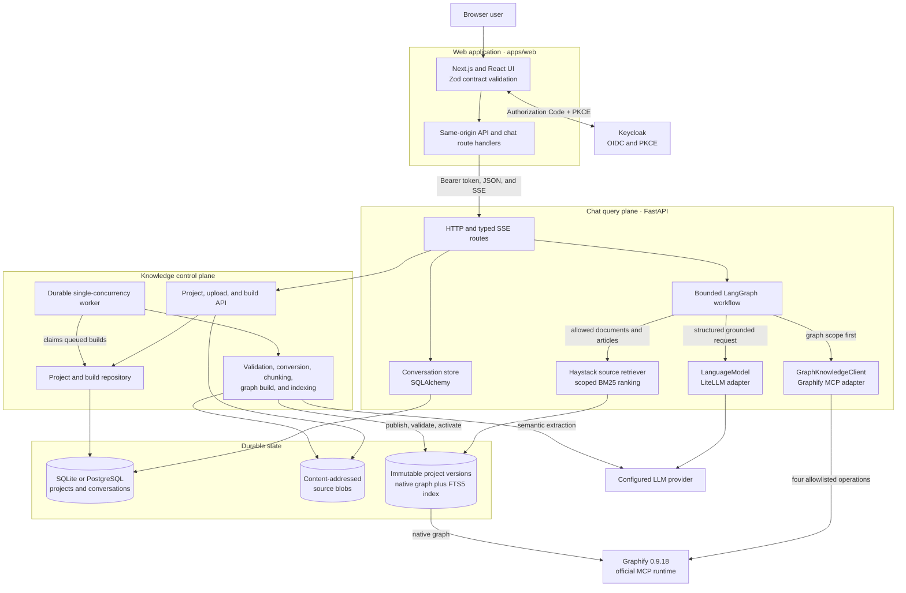

# Graphify Knowledge Agent POC

The default Compose stack pins the open-source `graphifyy==0.9.18` runtime and
`haystack-ai==2.31.0`. Editors upload supported Markdown, text, HTML, PDF, and
DOCX documents into immutable project snapshots. A durable worker builds native
Graphify graphs and version-local SQLite FTS5 source indexes before activation.

Graphify semantic extraction requires a valid provider credential. Copy
`.env.example` to `.env`, set unique Keycloak bootstrap values and
`OPENAI_API_KEY` (plus provider/model overrides when applicable), then run:

```bash
docker compose up --build
```

Graphify itself is MIT-licensed open source and needs no license key. The
credential above is for the LLM used during semantic document extraction.

The normal stack starts Graphify in pure multi-project mode and waits for an
explicit project build. The deterministic server is available only through:

```bash
docker compose -f docker-compose.yml -f docker-compose.synthetic.yml up --build
```

See [knowledge ingestion](docs/knowledge-ingestion.md) and the
[verified package/runtime report](docs/graphify/package-runtime-compatibility.md).

## Start

Requirements: Docker Engine with Docker Compose v2.

```bash
cp .env.example .env
docker compose up --build
```

When the services are healthy:

- Web UI: <http://localhost:3000>
- Backend API: <http://localhost:8000>
- OpenAPI documentation: <http://localhost:8000/docs>
- Keycloak: <http://localhost:8080>

The first image build downloads Python, Node, and application dependencies.
Ask a sample question such as:

> ¿Qué establece la Ley 100 de 1993 sobre el sistema general de pensiones?

For an article-level text retrieval example:

> Según el Artículo 49, ¿quiénes son los posibles beneficiarios?

With `LLM_ADAPTER=litellm`, answers use the configured model. With
`LLM_ADAPTER=mock`, deterministic answers exercise streaming and citation
contracts without an external answer model.

### PL/SQL analysis console (developer tool)

The authenticated `/plsql` console (ADR 0011) is an additive developer tool for
read-only PL/SQL analysis: deterministic object search, callers/callees and
table access with typed relationships, bounded dependency paths, unresolved
references, an evidence-linked read-only source viewer, and a bounded impact
report — never a graph editor. Design and vocabulary:
[docs/architecture/plsql-analysis-console.md](docs/architecture/plsql-analysis-console.md);
contract: [docs/architecture/contracts.md](docs/architecture/contracts.md);
status: [docs/plsql-analysis/implementation-plan.md](docs/plsql-analysis/implementation-plan.md).

It ships disabled by default and adds no behavior to the chat product. Enable it
deterministically on the synthetic stack (`PLSQL_ADAPTER=synthetic`,
`PLSQL_PROJECT_ID=sample`, `PLSQL_SOURCE_ROOT=/app/plsql-fixtures/source` on the
API; `PLSQL_ENABLED=true` on the web), or run

```bash
docker compose -f docker-compose.yml -f docker-compose.synthetic.yml up --build
```

with `make e2e` covering search → detail → callers/callees → table access →
paths → source → impact over the fixture corpus. Real mode
(`PLSQL_ADAPTER=neo4j`, official `neo4j` 5.x driver, ADR 0012 §0.1) is
implemented and opt-in: set `PLSQL_NEO4J_URI`/`PLSQL_NEO4J_USER`/
`PLSQL_NEO4J_PASSWORD` (server-side only) plus `PLSQL_SOURCE_ROOT`; a missing
URI or unreachable server reports the analysis state as `unavailable` in
`/ready` and the console. The adapter's query catalog pins the documented
graph model, with schema alignment validated against a live
`plsqlgraph`-synchronized instance.

## Runtime architecture

The browser authenticates with Keycloak Authorization Code + PKCE S256, keeps
tokens in memory, and talks only to Next.js routes. Next.js proxies project and
conversation calls and converts typed SSE events to the Vercel AI SDK data
stream. FastAPI owns a durable SQLAlchemy conversation store and invokes a
bounded LangGraph workflow. The workflow resolves follow-up references from a
sanitized history window, retrieves fresh Graphify evidence for every answer,
uses that evidence to bound Haystack BM25 retrieval over the original source
passages, and then calls the internal model interface implemented with LiteLLM.

Graphify remains the authoritative entity and relationship graph. Haystack does
not replace Graphify or add another network service: each immutable project
version contains a persistent SQLite FTS5 source-text index, while an ephemeral
Haystack document store ranks only the allowlisted passages for the current
request.



The retrieval boundary is deliberately one-way:

- Graphify runs first and determines the allowed source documents and articles.
- Haystack cannot retrieve passages from another document or expand that scope.
- Relationship claims require graph citations.
- Article contents and other textual legal claims require exact source-passage
  citations with document, article, paragraph, and line metadata.
- Missing article passages produce an insufficient-evidence response instead of
  an answer inferred from graph labels.

In the web UI, citations retrieved through Haystack are labeled
`Haystack passage` in the **Sources** drawer. Select
**Show full retrieved passage** to expand the complete indexed source text,
including its document, article, paragraph marker, and line range.

Project management uses a dedicated `/projects/{projectId}` workspace rather
than a modal. Its URL-backed sections cover overview, draft documents, access
and sharing, knowledge builds, and settings. Document uploads support both file
selection and drag and drop; member management uses tenant-scoped directory
users and groups.

Projects are private by default. Project roles are Viewer, Contributor, Manager,
and Owner; the highest direct or directory-group grant wins. Owners are named
users and the final Owner cannot be removed or demoted. Tenant administrators
can repair membership and audit access without automatically receiving access
to project content or private conversations. Public links, guest accounts, and
application-managed email invitations are intentionally out of scope.
Tenant administrators use the dedicated `/governance` workspace to discover
private projects and repair direct or group membership without entering the
project's document or conversation workspace.

Inside a project, the shared left navigation separates project capabilities
from conversation management. Conversation pages add a persistent context
panel with Files, Sources, and Graph views; selecting an inline citation opens
the matching source automatically. On smaller screens, navigation and context
move into accessible drawers.

Project file responses include additive lifecycle metadata. Files move through
uploaded, queued, validating, converting, graph-building, passage-indexing,
ready, or failed checkpoints. Percentages are durable phase checkpoints for the
atomic corpus build—not per-document elapsed-time estimates—and failures expose
only normalized error codes.

The browser never receives an LLM key or Graphify credentials and never connects
directly to Graphify. Only `query_graph`, `get_node`, `get_neighbors`, and
`shortest_path` are allowlisted. Project identity and immutable version paths
come from the authenticated server registry, never from document content or
model output.

See:

- [Architecture overview](docs/architecture/overview.md)
- [API and event contracts](docs/architecture/contracts.md)
- [Architecture decisions](docs/adr/decision-log.md)
- [Graphify adapter contract](contracts/mcp/graphify-adapter.md)
- [UI guidelines](docs/ui/ui-guidelines.md)

## Main modules

| Module | Responsibility |
| --- | --- |
| `apps/web/src/app` | Next.js routes, project and conversation pages, and same-origin backend proxies. The chat route translates backend SSE into the Vercel AI SDK data stream. |
| `apps/web/src/components` | Authenticated application shell, project workspace, chat, citations, evidence, graph context, and accessible responsive primitives. |
| `apps/web/src/lib` | Browser API client, in-memory token access, and Zod validation for every backend payload rendered by the UI. |
| `apps/api/app/api` | FastAPI route composition, authentication dependencies, public HTTP/SSE boundaries, request correlation, and normalized errors. |
| `apps/api/app/agent` | Bounded LangGraph orchestration: follow-up resolution, graph retrieval, source scoping, answer generation, citation validation, and terminal events. |
| `apps/api/app/integrations` | Provider adapters. `graphify` normalizes the four reviewed MCP operations, `haystack` ranks scoped source passages, and `llm` isolates LiteLLM/provider behavior. |
| `apps/api/app/knowledge` | Secure source discovery and conversion, deterministic structural chunking, FTS5 indexing, immutable version publication, activation, and rollback. |
| `apps/api/app/projects` | Project, upload, snapshot, and build persistence; content-addressed storage; and the durable knowledge-build worker. |
| `apps/api/app/store` | Conversation repository protocol and SQLAlchemy implementations for durable, subject-private histories. |
| `contracts` | Frozen OpenAPI, SSE, answer, evidence, MCP adapter, manifest, and active-pointer schemas shared across boundaries. |
| `tests/e2e` | Synthetic, recovery, persistence, and real-Spanish verification across the composed system. |

## Architectural patterns

- **Backend for frontend:** the browser calls same-origin Next.js routes; only
  server-side route handlers proxy authenticated calls to FastAPI and translate
  the SSE stream expected by the chat UI.
- **Ports and adapters:** workflow code depends on internal graph, retrieval,
  model, and persistence interfaces. Graphify MCP, Haystack, LiteLLM, SQLite,
  and PostgreSQL details stay at their adapters.
- **Bounded workflow:** explicit LangGraph stages and configured limits replace
  an open-ended tool loop. Tool calls, traversal, evidence, history, model
  iterations, and duration all have hard bounds.
- **Graph-first grounded retrieval:** Graphify establishes the document and
  article allowlist before Haystack ranks exact source passages. Source
  retrieval can narrow that scope but never broaden it.
- **Immutable snapshots and atomic activation:** uploads are sealed into a
  snapshot, builds publish a new version, and activation occurs only after both
  the native Graphify artifact and matching source index validate. Failed builds
  leave the active version untouched.
- **Control-plane/query-plane separation:** project ingestion is handled by a
  durable worker with write access, while chat retrieval remains request-bound,
  version-pinned, and read-only.
- **Schema validation at boundaries:** Pydantic validates backend and persistence
  structures, strict JSON Schemas constrain model output, Zod validates browser
  input, and public fields remain camelCase.
- **Dependency injection and composition roots:** FastAPI lifespan and dependency
  functions assemble concrete adapters from configuration, allowing explicit
  deterministic substitutes in tests and synthetic troubleshooting mode.
- **Typed streaming lifecycle:** named SSE events expose tool activity, answer
  deltas, citations, and exactly one completion or failure without leaking raw
  provider payloads or hidden reasoning.

## Configuration modes

### `TENANCY_MODE`

`TENANCY_MODE` controls how the API assigns authenticated users to tenants:

- `fixed` assigns every user to `TENANT_ID`; use it for a single organization.

  ```env
  TENANCY_MODE=fixed
  TENANT_ID=default
  TENANT_IDS=default
  ```

- `claim` reads the tenant from the signed token claim named by
  `AUTH_TENANT_CLAIM`; the value must be listed in `TENANT_IDS`.

  ```env
  TENANCY_MODE=claim
  AUTH_TENANT_CLAIM=tenant_id
  TENANT_IDS=acme,globex
  ```

Unknown tenant IDs are rejected. Keep tenant IDs synchronized with the identity
provider and application configuration.

Set `LOG_LEVEL=DEBUG` when diagnosing authentication. The API logs a sanitized
failure category and request ID, plus the underlying exception type at debug
level; bearer tokens and claims are never logged.

### Tenant access and directory search

Dedicated deployments use `TENANCY_MODE=fixed`, `TENANT_ID=default`, and an
allowlist containing that tenant in `TENANT_IDS`. Multi-tenant deployments use
`TENANCY_MODE=claim`; the signed claim named by `AUTH_TENANT_CLAIM` must match an
entry in `TENANT_IDS`. Unknown tenants are rejected rather than created from a
token.

Configure `KEYCLOAK_ADMIN_URL`, `KEYCLOAK_DIRECTORY_TOKEN_URL`,
`KEYCLOAK_DIRECTORY_CLIENT_ID`, and `KEYCLOAK_DIRECTORY_CLIENT_SECRET` for
provisioned user/group search when managing project access. The confidential
client requires only bounded realm user/group view permissions. Project
authorization reads the signed `AUTH_GROUPS_CLAIM` (default `groups`) from the
JWT, so configure the identity provider to emit stable group IDs in that claim.
Group changes take effect when the user receives a refreshed token.

### Set up users

1. Open Keycloak at <http://localhost:8080>, sign in with the bootstrap
   credentials from `.env`, and select the `graphify` realm.
2. Create users, set a password, and set their `tenant_id` user attribute to a
   value in `TENANT_IDS` (normally `default`). Assign the realm role `viewer`,
   `editor`, or `admin`; self-registration is disabled.
3. Create groups and add users when group-based project access is needed. Users
   receive project roles from the project **Access & sharing** section; realm
   roles control platform-level capabilities.

For production, provision users and groups through the organization’s identity
provider and configure the Keycloak directory service account. Do not commit
bootstrap passwords or user credentials.

### Directory setup

Keycloak is the application directory: it stores users, groups, memberships,
and the `tenant_id` attribute used for tenant filtering. To enable user/group
search in **Access & sharing**:

1. Create a confidential Keycloak client for the API with service-account access
   to read realm users and groups.
2. Set its client credentials and Admin API endpoints in `.env`:

   ```env
   KEYCLOAK_ADMIN_URL=http://keycloak:8080/admin/realms/graphify
   KEYCLOAK_DIRECTORY_TOKEN_URL=http://keycloak:8080/realms/graphify/protocol/openid-connect/token
   KEYCLOAK_DIRECTORY_CLIENT_ID=graphify-directory
   KEYCLOAK_DIRECTORY_CLIENT_SECRET=replace-me
   ```

3. Restart the API after changing these values:

   ```bash
   docker compose up -d --build api
   ```

Keep the client secret server-side. If these settings are empty, directory
search is unavailable, but JWT-based project authorization continues to work.

### Default real mode

`.env.example` selects `GRAPHIFY_RUNTIME_MODE=real` and the official MCP
adapter. Graph generation needs `OPENAI_API_KEY`. To generate answers with a
real OpenAI-compatible model, configure:

```env
LLM_ADAPTER=litellm
LLM_MODEL=your-litellm-model-name
LLM_API_BASE=https://your-openai-compatible-endpoint/v1
LLM_API_KEY=replace-me
OPENAI_API_KEY=replace-me
```

### Explicit synthetic troubleshooting mode

```bash
docker compose -f docker-compose.yml -f docker-compose.synthetic.yml up --build
```

Synthetic MCP tests do not validate compatibility with the real Graphify
runtime.

### Conversation persistence

The default single-API deployment stores conversations in SQLite under
`/knowledge/state` on the persistent `graphify_knowledge` named volume. To use
the tested PostgreSQL backend instead:

```bash
docker compose -f docker-compose.yml -f compose/postgres.yml up --build
```

Each project has server-backed active and archived conversation lists. Histories
are private to the authenticated subject even though project files are shared.
The browser keeps the selected project and conversation UUID only as convenience
hints and validates them against the server. Previous turn text is bounded and
sanitized before it is supplied to follow-up
resolution. It is never accepted as knowledge evidence: citations must match
graph or bounded source evidence retrieved for the current request.

### Source-text index

Knowledge ingestion preserves original bytes and checksums for Graphify, then
converts supported files into normalized text. Ordered structural profiles
split on pages, Markdown headings, and legal articles before applying bounded
`o200k_base` token chunks. SQLite stores leaf and parent hierarchy, media type,
profile, normalized-text offsets, page/section/article metadata, checksum,
processing fingerprint, and graph version. The default location is:

```env
KNOWLEDGE_SOURCE_INDEX_PATH=/knowledge/state/source-index.sqlite
```

Passages for multiple graph versions can coexist in SQLite. The active manifest
version selects the matching graph and source rows, so staging or a failed index
rebuild does not replace the previously active evidence. Unchanged input
checksums and the processing fingerprint continue to use the ingestion skip
path. A rollback selects the prior graph version and its corresponding source
passages.

SQLite uses FTS5 with Unicode diacritic handling, allowing accented and
unaccented Spanish queries without an embedding model, vector database,
Elasticsearch, or OpenSearch.

Never commit `.env`, provider keys, proprietary source material, or proprietary
Graphify projects. Do not prefix secrets with `NEXT_PUBLIC_`.

## Developer commands

```bash
make setup          # create .env if absent, build images
make dev            # docker compose up --build
make up-postgres    # use the optional PostgreSQL conversation backend
make test           # backend and frontend tests in image build stages
make lint           # Ruff/format/mypy and ESLint/TypeScript checks
make e2e            # explicit synthetic stack plus Playwright suite
make compose-check  # validate the Compose model
make compose-check-postgres
make smoke          # check web, API health, and API readiness
make knowledge-ingest
make knowledge-status
make knowledge-rebuild
make knowledge-rollback
make test-graphify-real
make smoke-spanish
make logs           # follow service logs
make down           # stop services
make clean          # stop services and remove the named knowledge volume
```

`make e2e` installs Playwright dependencies on the host and therefore requires
Node/npm in addition to Docker. See [Getting started](docs/getting-started.md)
for direct test commands.

## Scope and limitations

- The bundled Keycloak `start-dev` service is for local development only.
- Active conversations are retained indefinitely. Archived conversations expire
  after 30 days by default, and histories retain at most 100 complete exchanges.
- The browser stores only project selection and one conversation ID per project
  in `localStorage`; access tokens remain in memory.
- Conversation lists and independent histories synchronize through the API.
- Projects are tenant-scoped and private to direct users and directory groups;
  public links, guest identities, and email invitations are out of scope.
- Uploaded bytes use the local Docker volume; object storage is out of scope.
- Source-text retrieval is lexical BM25; no semantic embedding retriever is
  configured.
- Article-detail answers require both a Graphify article scope and matching
  source passages.
- If Haystack is unavailable, sufficiently supported graph-only relationship
  questions may continue, but article-detail questions return insufficient
  evidence.
- The synthetic troubleshooting profile is not Graphify and cannot establish
  compatibility with Graphify 0.9.18.
- The deterministic model proves integration behavior, not answer quality.
- Readiness verifies the active graph and initializes an official MCP session to
  validate the allowlisted tool schemas. It reports model configuration without
  making a billable LLM request.
- Generated answers are a technical demonstration, not legal advice.
- OpenTelemetry instrumentation is enabled where the installed instrumentation
  supports it, but no collector/export pipeline is included.
- This is a local POC, not a hardened multi-user or production deployment.

For common failures, see [Troubleshooting](docs/troubleshooting.md).
