# PL/SQL Dependency and Impact Analysis Architecture

## 1. Purpose

The solution provides developers and architects with navigable PL/SQL dependency and impact analysis.

The system should allow users to:

- Search packages, routines, tables, views and triggers.
- Understand upstream and downstream dependencies.
- Analyze the impact of changing a package, procedure or function.
- Inspect routine call hierarchies and table read/write dependencies.
- Find dependency paths between objects.
- Visualize static execution flows.
- Navigate from graph relationships to the exact PL/SQL source code.

The solution behaves as a **PL/SQL code-intelligence and impact-analysis platform**, with Neo4j acting as the semantic knowledge layer which is in the repo `/home/oortiz/oao/plsqlgraph`.

---

# 2. Architecture Principles

1. **Xtext/Ecore is the authoritative PL/SQL language model.**
2. Parsing, semantic analysis, graph persistence and UI concerns remain separated.
3. Neo4j stores semantic dependencies optimized for graph traversal.
4. Every dependency should retain source-code evidence when possible.
5. The configured local source folder is the authoritative source of PL/SQL code.
6. Source navigation uses file path and source range.
7. The UI exposes developer operations rather than generic Cypher queries.
8. Graph visualization uses progressive disclosure.
9. Impact analysis uses bounded graph traversal.
10. Static-analysis uncertainty must be explicitly represented.

---

# 3. High-Level Architecture

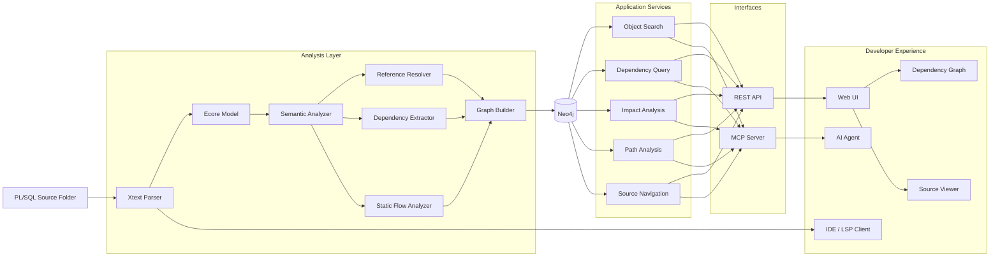

---

# 4. Processing Pipeline

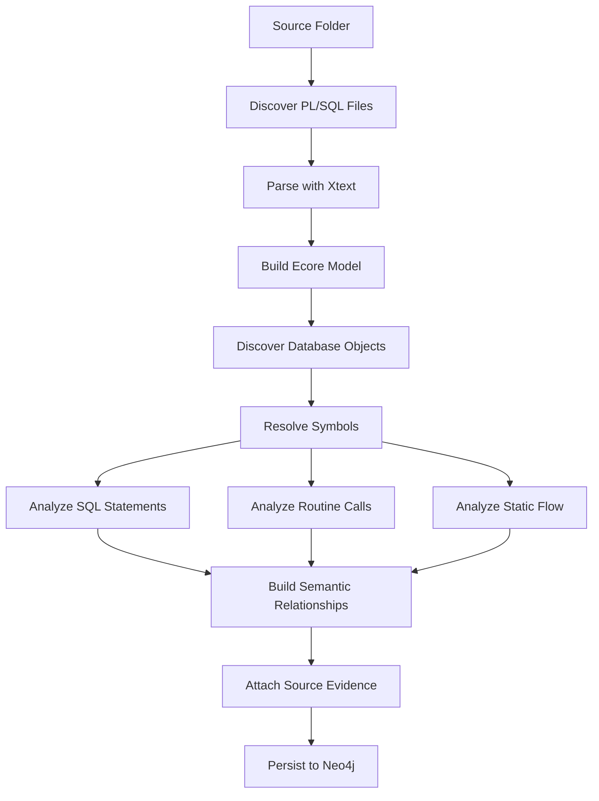

---

# 5. Core Graph Model

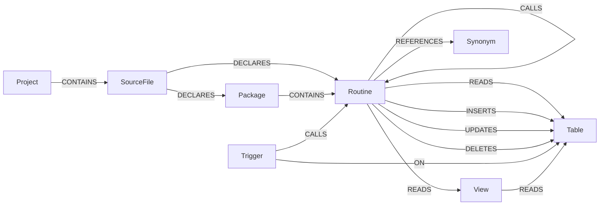

Relationship semantics should remain explicit.

Avoid generic relationships such as:

```text
USES
```

when more precise information exists.

Prefer:

```text
CALLS
READS
INSERTS
UPDATES
DELETES
REFERENCES
```

---

# 6. Source Evidence Model

Every relevant object and dependency should retain enough information to navigate back to source code.

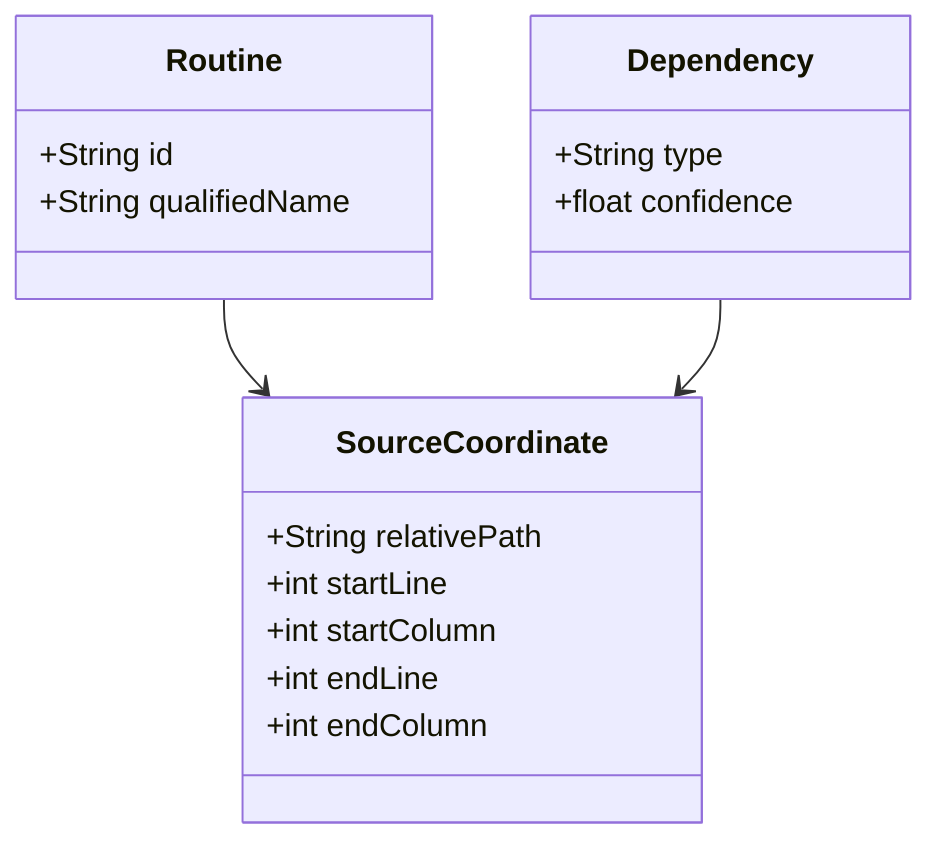

Example:

```text
relativePath: packages/FA_QMORA.pkb
startLine: 125
endLine: 131
```

The configured project root provides the absolute location:

```text
sourceRoot + relativePath
```

Example:

```text
C:/projects/plsql/
+
packages/FA_QMORA.pkb
```

---

# 7. Source Navigation

Source navigation should be a first-class capability.

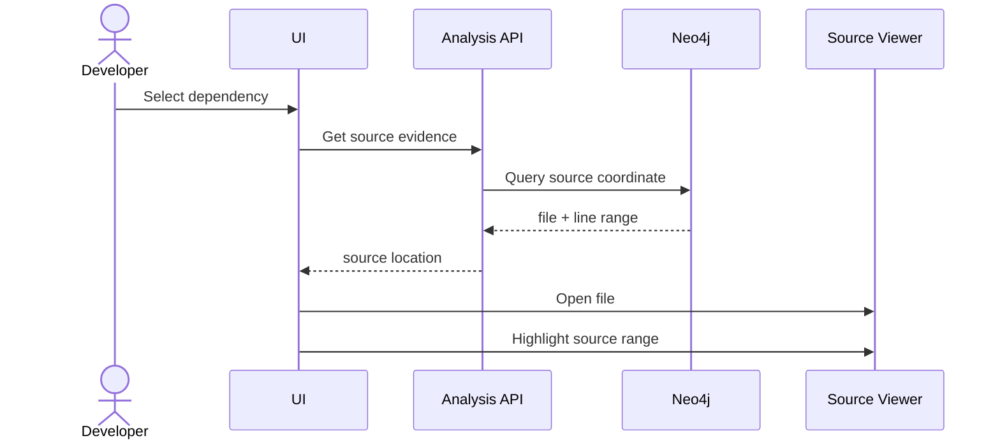

The UI should allow navigation to:

- Routine definition.
- Routine call.
- SQL statement.
- Table reference.
- Trigger definition.
- View definition.

---

# 8. Recommended UI

Use a persistent selected-object context.

```text
┌─────────────────────────────────────────────────────────────┐
│ Search: FA_QMORA.CALCULO_MORA                               │
├───────────────┬──────────────────────────────┬──────────────┤
│ Navigation    │ Main View                    │ Details      │
│               │                              │              │
│ Overview      │ Dependency Graph             │ Object       │
│ Calls         │ Call Hierarchy               │ Relations    │
│ Called By     │ Data Lineage                 │ Source       │
│ Tables        │ Paths                        │              │
│ Paths         │ Impact Analysis              │              │
│ Impact        │ Source                       │              │
└───────────────┴──────────────────────────────┴──────────────┘
```

Main views:

- Overview
- Dependency Graph
- Call Hierarchy
- Data Lineage
- Dependency Paths
- Impact Analysis
- Static Execution Flow
- Source

---

# 9. Dependency Graph Pattern

Use **focus + context**.

Do not render the entire project graph by default.

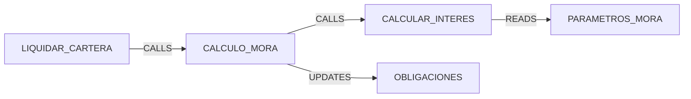

The user should explicitly expand:

```text
Expand callers
Expand callees
Expand reads
Expand writes
Expand one level
```

This avoids unreadable graphs for large PL/SQL systems.

---

# 10. Call Hierarchy

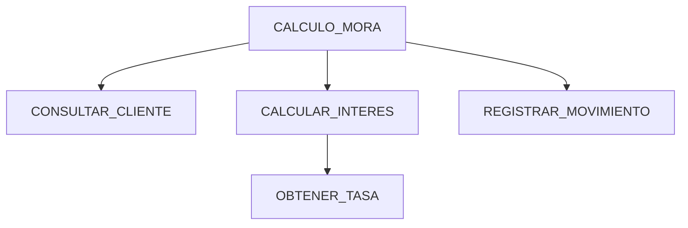

Expose both directions:

```text
Calls
Called By
```

They answer different questions:

```text
Calls:
What can this routine affect?

Called By:
What may be affected if this routine changes?
```

---

# 11. Data Lineage

For tables, expose readers and writers.

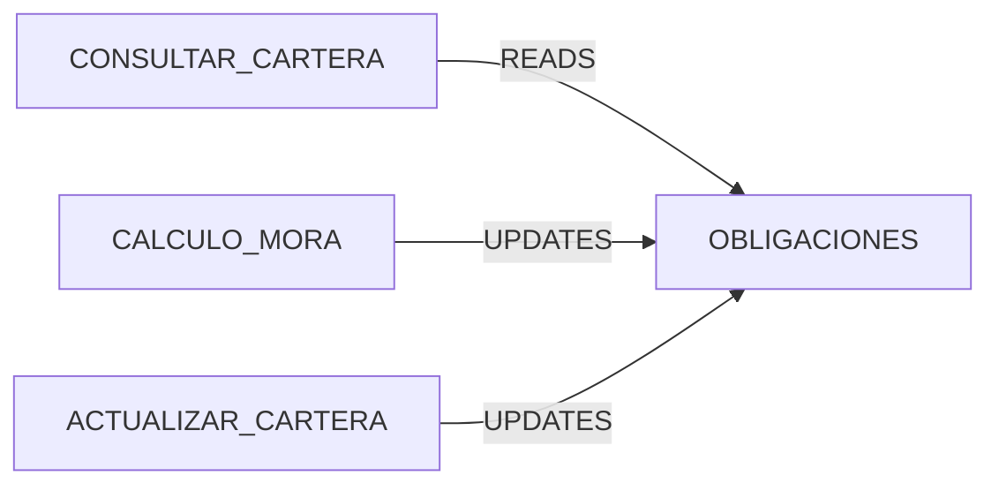

Useful table views:

```text
Readers
Inserters
Updaters
Deleters
Triggers
Views
```

---

# 12. Dependency Path Analysis

Path analysis answers questions such as:

> How can routine A affect table B?

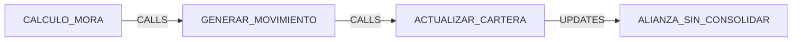

Support:

```text
Shortest path
Bounded paths
Only CALL paths
Only WRITE paths
Cross-package paths
```

Traversal depth must be bounded.

---

# 13. Impact Analysis

Impact analysis should separate different dependency categories.

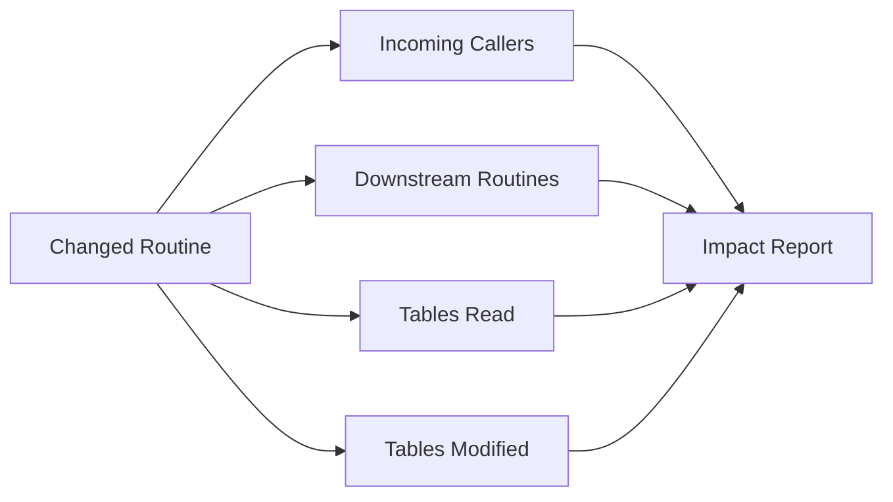

Example output:

```text
CALCULO_MORA

Direct callers:          4
Downstream routines:    12
Tables read:             6
Tables modified:         3

High-impact tables:
OBLIGACIONES
MOVIMIENTOS
SALDOS_CLIENTE
```

---

# 14. Explainable Impact

Impact results should always provide evidence.

Prefer:

```text
OBLIGACIONES — HIGH

Path:
CALCULO_MORA
  → GENERAR_MOVIMIENTO
  → ACTUALIZAR_CARTERA
  → OBLIGACIONES

Source:
packages/FA_QMORA.pkb:125
```

rather than only:

```text
OBLIGACIONES — HIGH
```

Impact scoring should therefore remain explainable.

---

# 15. Static Execution Flow

Sequence diagrams can complement dependency analysis.

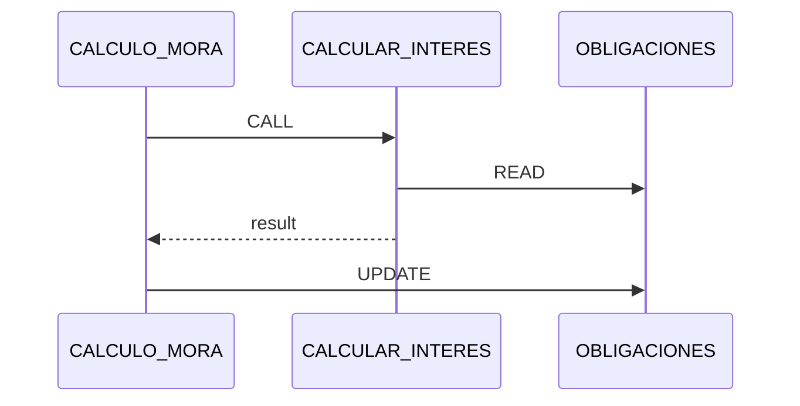

The UI should label this as:

**Static Execution Flow**

because actual runtime behavior may differ due to:

- Conditions
- Loops
- Exceptions
- Dynamic SQL
- Triggers

---

# 16. Application Architecture

Use a small application layer between Neo4j and the interfaces.

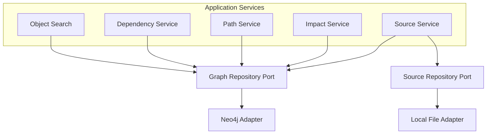

This prevents:

```text
Neo4j queries
filesystem access
UI concerns
```

from becoming mixed inside the same components.

---

# 17. Recommended Patterns

## Hexagonal Architecture

Use ports around external infrastructure.

```text
Application
   ↓
GraphRepository
SourceRepository
   ↓
Neo4jAdapter
LocalFileAdapter
```

Benefits:

- Easier testing.
- Neo4j does not leak into business logic.
- Filesystem access remains replaceable.
- Future Git integration can be added without redesigning the domain.

---

## Repository Pattern

Encapsulate graph access behind domain operations.

Prefer:

```text
dependencyRepository.findCallers(...)
impactRepository.findDownstreamImpact(...)
```

instead of using Cypher throughout application services.

---

## Value Objects

Use immutable domain types for concepts such as:

```text
QualifiedObjectName
SourceCoordinate
DependencyPath
SourceRange
```

Avoid passing unrelated primitive strings and integers throughout the code.

---

## Adapter Pattern

Infrastructure implementations should remain explicit:

```text
Neo4jGraphRepository
LocalSourceRepository
```

Future implementations could add:

```text
GitSourceRepository
```

without changing application services.

---

# 18. API Boundary

Expose developer-oriented operations.

```text
GET /objects
GET /objects/{id}

GET /objects/{id}/dependencies
GET /objects/{id}/callers
GET /objects/{id}/callees
GET /objects/{id}/tables

GET /objects/{id}/impact

GET /paths
    ?from={id}
    &to={id}

GET /objects/{id}/source

GET /relationships/{id}/evidence
```

Do not expose raw Cypher through the UI API.

---

# 19. MCP Integration

MCP should reuse the same application services.

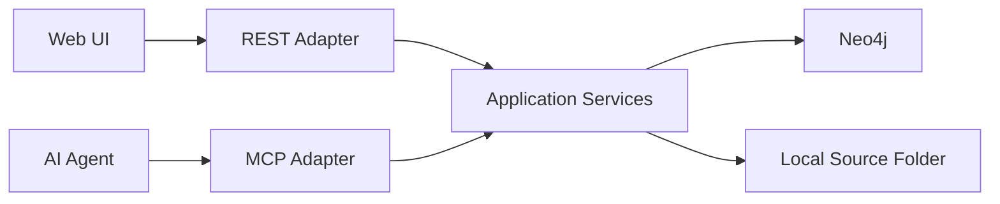

Recommended tools:

```text
search_objects
get_dependencies
get_callers
get_callees
find_dependency_paths
analyze_impact
get_source_evidence
get_source
```

Do not duplicate graph logic inside the MCP implementation.

---

# 20. Recommended Technology Responsibilities

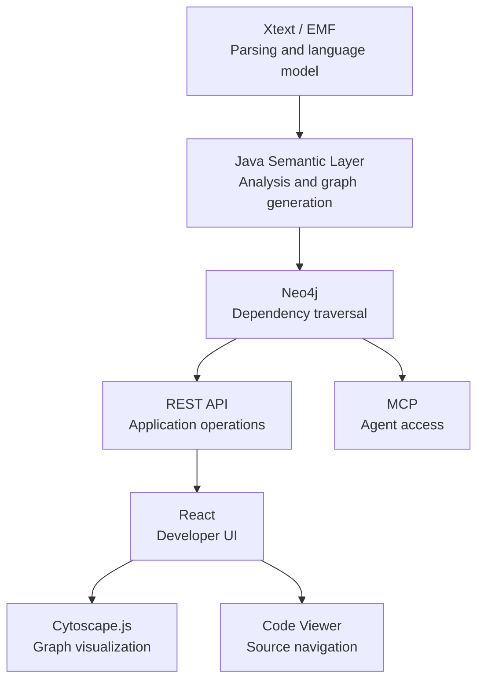

---

# 21. Visualization Decision

## Recommended: Cytoscape.js

Best fit for:

- Directed dependency graphs.
- Graph exploration.
- Automatic graph layouts.
- Compound/package nodes.
- Path highlighting.
- Progressive expansion.
- Larger relationship networks.

## Alternative: React Flow

Better suited for:

- User-editable diagrams.
- Workflow builders.
- Manual node positioning.

For dependency analysis, prefer **Cytoscape.js**.

---

# 22. Source Viewer Decision

The source viewer should initially be read-only.

Required capabilities:

```text
Open file
Line numbers
Syntax highlighting
Scroll to source range
Highlight source range
Search
Copy file path
```

Potential options:

- Monaco Editor.
- CodeMirror.

Avoid building a custom source editor.

Editing source code through the web UI is outside the MVP scope.

---

# 23. Incremental Analysis

Start with full indexing.

Preserve metadata required for incremental processing later:

```text
relativePath
contentHash
source ownership
source range
```

Future incremental flow:

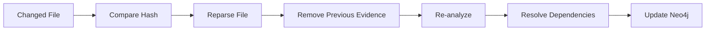

Do not optimize incremental analysis before semantic correctness is stable.

---

# 24. Dynamic and Unresolved Dependencies

Static analysis cannot always resolve dependencies.

Examples:

```text
EXECUTE IMMEDIATE
dynamic table names
DB links
generated SQL
complex synonym resolution
```

Represent uncertainty explicitly.

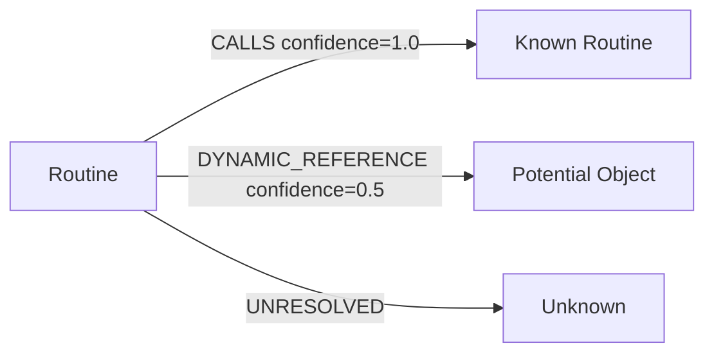

Never represent inferred dependencies as certain.

---

# 25. MVP Scope

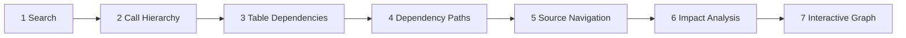

MVP capabilities:

1. Configure a local PL/SQL source folder.
2. Parse and index PL/SQL files.
3. Search packages, routines and tables.
4. Show callers and callees.
5. Show table read/write relationships.
6. Find bounded dependency paths.
7. Navigate to exact source code.
8. Provide impact analysis.
9. Display an interactive dependency graph.
10. Expose analysis through MCP.

---

# 26. Architecture Decision Records

Only decisions that materially affect the architecture should be formalized.

---

## ADR-001 — Source Coordinate Model

### Decision

How should graph elements reference source code?

### Options

**A. Absolute file path**

Simple but environment-dependent.

**B. Relative file path + configured source root**

Portable and simple.

### Decision

Use:

```text
sourceRoot
+
relativePath
+
source range
```

Graph entities should store the relative path and source range.

The project configuration stores the source root.

---

## ADR-002 — Graph Visualization Library

### Candidates

- Cytoscape.js
- React Flow

### Decision

Use **Cytoscape.js** for dependency visualization.

Reason:

The problem is graph exploration rather than diagram authoring.

---

## ADR-003 — Source Viewer

### Candidates

- Monaco
- CodeMirror
- Custom renderer

### Decision

Evaluate Monaco and CodeMirror with a small spike.

Minimum criteria:

```text
PL/SQL highlighting
large files
line navigation
range highlighting
bundle size
read-only performance
```

Do not create a custom editor.

---

## ADR-004 — Graph Access Architecture

### Options

- Cypher directly from services.
- Graph repository abstraction.

### Decision

Use a **Graph Repository abstraction**.

Neo4j remains an infrastructure implementation.

---

## ADR-005 — Source Access Architecture

### Options

- Direct filesystem calls from application services.
- SourceRepository abstraction.

### Decision

Use a **SourceRepository port** backed initially by a local-filesystem adapter.

This keeps future Git integration possible without affecting the application layer.

---

## ADR-006 — Dependency Evidence Representation

### Options

**Relationship properties**

Simple:

```text
UPDATES {
  path,
  startLine,
  endLine
}
```

**Evidence nodes**

More expressive but more complex.

### Decision

Use relationship properties for the MVP.

Introduce explicit evidence nodes only if:

- one dependency has multiple source occurrences,
- evidence requires independent lifecycle,
- analyzer provenance needs to be stored.

---

## ADR-007 — API Style

### Options

- Raw Cypher.
- Generic graph API.
- Domain-oriented REST.

### Decision

Use **domain-oriented REST**.

Examples:

```text
/callers
/callees
/dependencies
/impact
/paths
/source
```

Cypher remains internal.

---

## ADR-008 — Indexing Strategy

### Initial Decision

Use full indexing for the POC/MVP.

Store:

```text
relativePath
contentHash
source ownership
```

to allow incremental analysis later.

---

## ADR-009 — Impact Scoring

### Decision

Calculate impact severity at query time.

Do not store impact level as permanent graph data.

Possible inputs:

```text
relationship type
distance
writes
callers
trigger activation
dynamic SQL
confidence
```

This allows impact rules to evolve independently from graph indexing.

---

# 27. ADR Priority

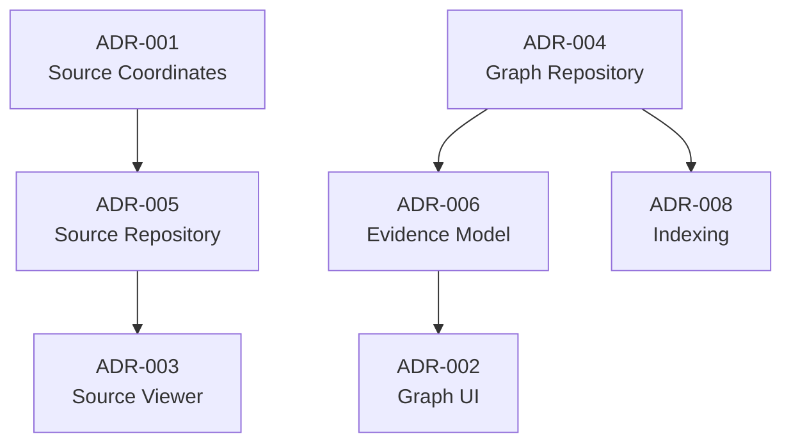

Highest-priority decisions:

1. Source coordinate model.
2. Graph repository boundary.
3. Source repository boundary.
4. Evidence representation.
5. Graph visualization.
6. Source viewer.

---

# 28. Target Architecture

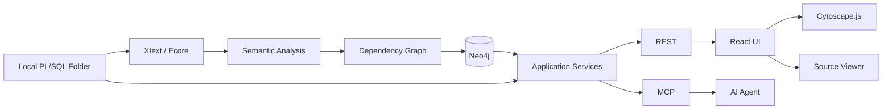

---

# 29. Future Extensions

The architecture should allow, but not currently implement:

- Git repository integration.
- Pull-request impact analysis.
- Revision comparison.
- Incremental indexing.
- Column-level lineage.
- Control-flow graphs.
- Trigger execution chains.
- Business capability mapping.
- IDE-specific graph views.
- AI-generated business-logic explanations.

These extensions should reuse the existing:

```text
SourceRepository
GraphRepository
SourceCoordinate
Application Services
```

rather than changing the core domain architecture.

---

# 30. Architectural Outcome

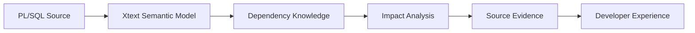

The key flow is:

```text
Local PL/SQL source
        ↓
Xtext / Ecore
        ↓
Semantic dependencies
        ↓
Neo4j
        ↓
Impact / path analysis
        ↓
Exact source evidence
        ↓
Developer or architect
```

The graph is therefore a semantic knowledge layer supporting:

- Find usages.
- Call hierarchy.
- Table lineage.
- Dependency exploration.
- Blast-radius analysis.
- Path analysis.
- Source navigation.
- Explainable change impact.