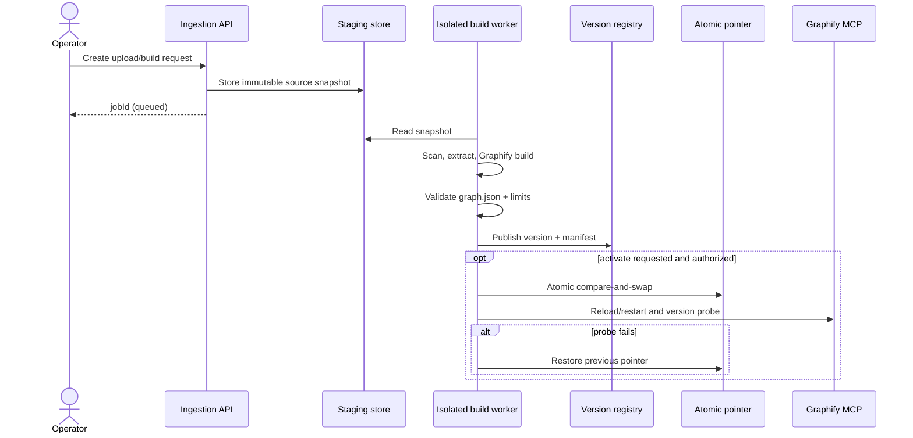

# Ingestion Lifecycle and Data Model

## Boundary

Ingestion is asynchronous and outside the chat request path. It accepts a
declared source snapshot, builds through Graphify-supported tooling, validates
the resulting native artifact, publishes an immutable version, and optionally
activates it.



## State models

A build job progresses monotonically:

```text
queued -> scanning -> building -> validating -> published
                                      |             |
                                      v             v
                                    failed       activating
                                                    |
                                           active | rollback_failed
```

Cancellation is permitted only before `published`; publication is immutable.
Activation is a separate permission and operation. A failed build cannot become
active.

The version manifest is the durable handoff between build and query planes. It
includes project/source/version identity, Graphify format metadata, checksums,
counts, timestamps, and validation status. The active pointer contains only
project, selected version, prior version, generation, and activation metadata.

## Validation gates

Before publication:

1. reject archives with traversal, absolute paths, links, device files, or
   decompressed size/file-count excess;
2. malware/content scan according to deployment policy;
3. allow only declared source types and deterministic extraction settings;
4. run Graphify build commands in an isolated, resource-bounded worker;
5. require exactly one regular native `graph.json` at the declared relative
   artifact path;
6. validate JSON syntax and Graphify-version compatibility using
   vendor-supported validation where available;
7. enforce configured node, edge, artifact-byte, and build-time limits;
8. calculate SHA-256 after the final write and before publication;
9. publish by same-filesystem atomic rename into `versions/<graphVersion>`.

## Atomic activation

Activation is compare-and-swap:

1. read and validate the current pointer;
2. require the caller's `expectedGeneration`;
3. verify the target manifest is `validated` and its checksum still matches;
4. write a complete next pointer to a same-directory temporary regular file;
5. `fsync` the file, atomically rename it to `active.json`, then `fsync` the
   directory;
6. reload/restart Graphify and probe the target version;
7. on failure, perform another atomic pointer update to the previous validated
   version and verify it.

Concurrent activation with a stale generation fails with a conflict. Deleting
the active or previous version is forbidden. Retention is an explicit,
auditable operation.

## Failure recovery

- Staging and failed build data may be quarantined and later expired.
- A process crash before publish leaves no visible version.
- A crash after publish but before activation leaves an inactive valid version.
- A crash after pointer rename is reconciled by comparing `active.json` with the
  version Graphify reports.
- If both activation and rollback verification fail, the service is
  `rollback_failed`; Graphify is taken out of readiness until operator action.
