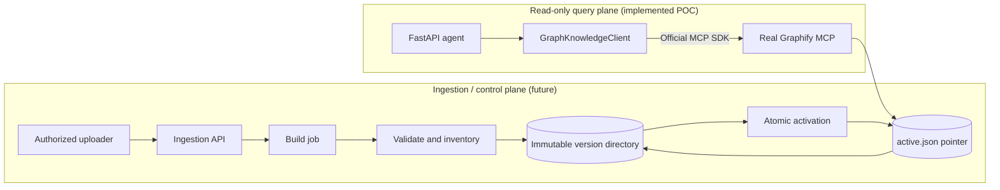

# Knowledge Architecture

Status: shared knowledge contracts frozen on 2026-07-28.

## Scope

The current POC is a read-only query plane for one server-configured Graphify
project. It does not ingest user content. A future ingestion plane may build and
activate graph versions, but it remains separate from chat and from the
`GraphKnowledgeClient` MCP boundary.

The deployment unit owns one `projectId`. `GRAPHIFY_PROJECT_ID` and
`GRAPHIFY_PROJECT_PATH` remain trusted process configuration. Neither the
browser, uploaded content, nor the LLM can choose a filesystem path or MCP tool.

## Knowledge artifacts

Each successful build produces:

- a Graphify-native `graph.json`;
- a `manifest.json` conforming to
  `contracts/knowledge/graph-build-manifest.schema.json`;
- optionally immutable source artifacts referenced by safe relative paths;
- checksums for every published artifact.

Published versions are never edited. `active.json`, conforming to
`contracts/knowledge/active-pointer.schema.json`, selects exactly one validated
version. The active pointer is operational metadata, not graph content.

## Identity and version semantics

- `projectId` is a stable logical knowledge domain.
- `graphVersion` is an opaque, immutable build identifier generated by the
  control plane, not by clients or the model.
- `sourceVersion` identifies the immutable input snapshot.
- A completed answer records the graph version reported by Graphify.
- Activating or rolling back changes only the pointer; it never rewrites a
  version.
- Existing in-flight queries may finish on the old version. Each response must
  name the version actually queried; a response must not combine versions.

## Trust boundaries

Source archives, filenames, documents, graph properties, and MCP results are
untrusted data. Build workers run without model credentials and with no access
to the chat API store. Query containers mount published knowledge read-only.
Only the activator can update `active.json`.

See [deployment](deployment.md), [ingestion lifecycle](ingestion-lifecycle.md),
and [future upload boundary](future-upload-boundary.md).
