# Oracle Forms 6i Ecore Metamodel Architecture

## 1. Purpose

Define the EMF/Ecore architecture for Oracle Forms 6i using the XML produced by `frmf2xml`, based on the reviewed `oracleforms.xsd`, while reusing the existing Oracle PL/SQL Xtext/Ecore model.

The model must support:

- faithful ingestion of Oracle Forms XML;
- structural navigation across Forms objects;
- extraction and parsing of embedded PL/SQL;
- semantic references between Forms objects;
- dependency and impact analysis;
- future graph export and modernization analysis.

## 2. XSD Review Summary

The reviewed XSD has target namespace:

```text
http://xmlns.oracle.com/Forms
```

Relevant schema characteristics:

- `Module` is the XML envelope and contains exactly one of `FormModule`, `ObjectLibrary`, or `MenuModule`.
- The schema defines 43 global elements, 41 complex types, and 110 simple types.
- `FormModule` contains 18 kinds of child objects.
- `Block` contains `DataSourceArgument`, `DataSourceColumn`, `Item`, `Relation`, and `Trigger`.
- `Item` contains `RadioButton`, `Trigger`, and `ListItemElement`.
- `Canvas` contains `Graphics`, `TabPage`, and `VisualState`.
- `Event` and `PropertyClass` can contain `Trigger` objects.
- `LOV` contains `LOVColumnMapping`.
- `RecordGroup` contains `RecordGroupColumn`, which contains `RecordGroupColumnRow`.
- `Graphics` is recursive and may contain `CompoundText`, nested `Graphics`, and `Point`.
- `PropertyClass` uses the XSD `JdapiProperties` attribute group, which exposes approximately 500 possible Forms properties.
- Several XSD enum types accept both textual and numeric values, for example `Table` and `1` for `QueryDataSourceType`.

These findings require changes to the previous metamodel proposal.

## 3. Changes from the Previous Definition

| Previous definition | Revised decision |
|---|---|
| Hand-written StAX importer as primary XML parser | Generate a raw EMF model from the XSD and deserialize XML through EMF; keep a mapper into the semantic model |
| `Relation` directly contained by `FormModule` | `Relation` is contained by `Block` |
| `Window` contains `Canvas` | No containment. The XSD links them through names such as `Canvas.WindowName` and `Window.PrimaryCanvas` |
| Limited `FormModule` children | Add XSD-defined objects such as `Coordinate`, `AttachedLibrary`, `Editor`, `Event`, `Menu`, `ObjectGroup`, and `Report` |
| Canvas represented mainly as a display container | Add contained `Graphics`, `TabPage`, and `VisualState` |
| Item contained only triggers | Add `RadioButton` and `ListItemElement` |
| Property bag considered optional convenience | Keep full raw XSD properties in the generated XML model; promote only semantically relevant properties to the canonical Forms model |
| XSD mapped directly to canonical Forms model | Use separate raw and semantic Ecore models |

## 4. Recommended Architecture

Use two EMF models.

1. **Raw XML model** generated from `oracleforms.xsd`.
2. **Canonical semantic Forms model** designed for analysis, Xtext integration, navigation, and graph generation.

```mermaid
flowchart LR
    FMB["Oracle Forms 6i<br/>.fmb"] --> F2X["frmf2xml"]
    F2X --> XML["Oracle Forms XML"]

    XSD["oracleforms.xsd"] --> GEN["EMF XSD Import<br/>Generate Ecore + GenModel"]
    GEN --> RAW["oracle.forms.xml.ecore<br/>Generated Raw Model"]

    XML --> LOAD["EMF XML Resource"]
    RAW --> LOAD

    LOAD --> MAP["FormsSemanticMapper"]
    MAP --> SEM["oracle.forms.model.ecore<br/>Canonical Semantic Model"]

    SEM --> CODE["Embedded Code Extractor"]
    CODE --> PLSQL["Existing PL/SQL Xtext Parser"]
    PLSQL --> PAST["PL/SQL EMF AST"]

    SEM --> LINK["Forms Semantic Linker"]
    PAST --> LINK

    LINK --> ANALYSIS["Analysis Model"]
    ANALYSIS --> UI["Eclipse Navigation"]
    ANALYSIS --> GRAPH["Neo4j / Impact Analysis"]
```

### Rationale

The generated raw model guarantees schema fidelity and avoids manually maintaining mappings for hundreds of XML attributes. The canonical model remains stable, smaller, and focused on behavior and dependencies.

Do not use the XSD-generated Ecore directly as the domain model because it preserves XML serialization concerns, string-based references, schema-specific naming, and large generic property sets that are not ideal for semantic analysis.

## 5. XSD Structural Model

The XML envelope is:

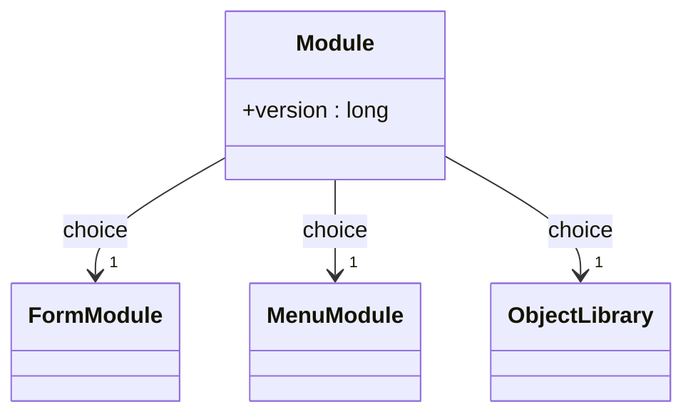

For the initial `.fmb` scope, `FormModule` is the canonical root after import. `Module` can remain part of the raw XSD model only.

## 6. FormModule Containment

The XSD defines the following direct children of `FormModule`:

```mermaid
classDiagram
    class FormModule
    class Coordinate
    class Alert
    class AttachedLibrary
    class Block
    class Canvas
    class Editor
    class Event
    class ModuleParameter
    class LOV
    class Menu
    class ObjectGroup
    class ProgramUnit
    class PropertyClass
    class RecordGroup
    class Report
    class Trigger
    class VisualAttribute
    class Window

    FormModule *-- "0..*" Coordinate
    FormModule *-- "0..*" Alert
    FormModule *-- "0..*" AttachedLibrary
    FormModule *-- "0..*" Block
    FormModule *-- "0..*" Canvas
    FormModule *-- "0..*" Editor
    FormModule *-- "0..*" Event
    FormModule *-- "0..*" ModuleParameter
    FormModule *-- "0..*" LOV
    FormModule *-- "0..*" Menu
    FormModule *-- "0..*" ObjectGroup
    FormModule *-- "0..*" ProgramUnit
    FormModule *-- "0..*" PropertyClass
    FormModule *-- "0..*" RecordGroup
    FormModule *-- "0..*" Report
    FormModule *-- "0..*" Trigger
    FormModule *-- "0..*" VisualAttribute
    FormModule *-- "0..*" Window
```

The semantic model should retain this containment where it represents real Forms ownership.

## 7. Core Canonical Ecore Hierarchy

The XSD itself does not define a shared superclass for Forms objects. The canonical Ecore should introduce one for identity, navigation, and source traceability.

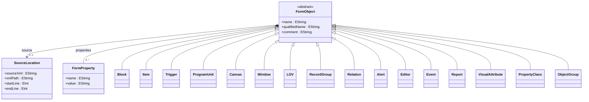

`FormProperty` is not intended to replace typed semantic attributes. It is used only when a property is useful to retain but does not justify a dedicated EAttribute in the canonical model. The raw generated model remains the authoritative complete representation of XSD properties.

## 8. Block Model

The XSD defines the following containment:

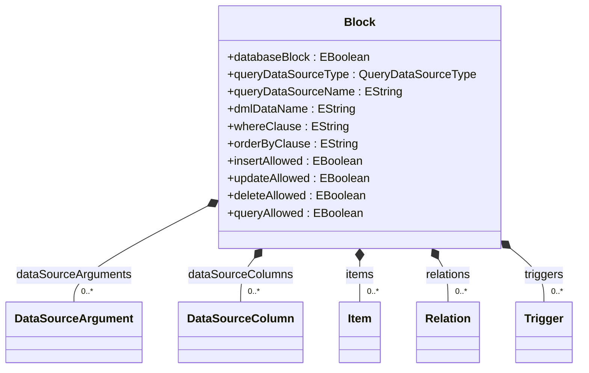

The XSD `QueryDataSourceType` values include:

```text
None
Table
Procedure
Transactional Triggers
FROM clause query
```

The semantic model must therefore not assume that every database block maps directly to a table.

### Recommended semantic references

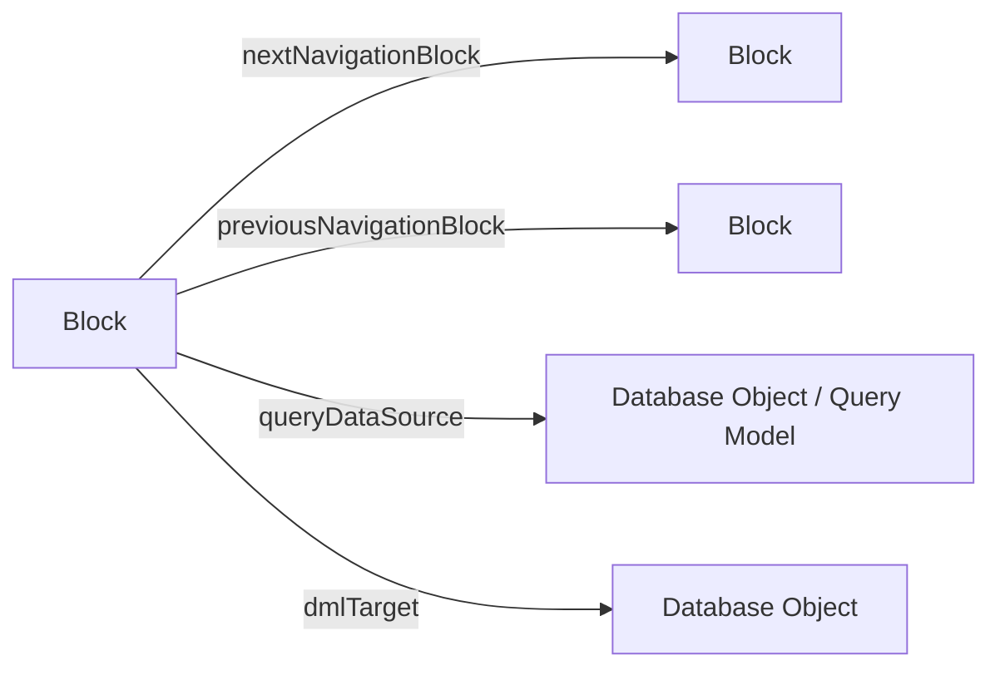

Database targets should be resolved in the analysis layer, not by coupling `OracleForms.ecore` directly to the PL/SQL/database model.

## 9. Item Model

The XSD defines:

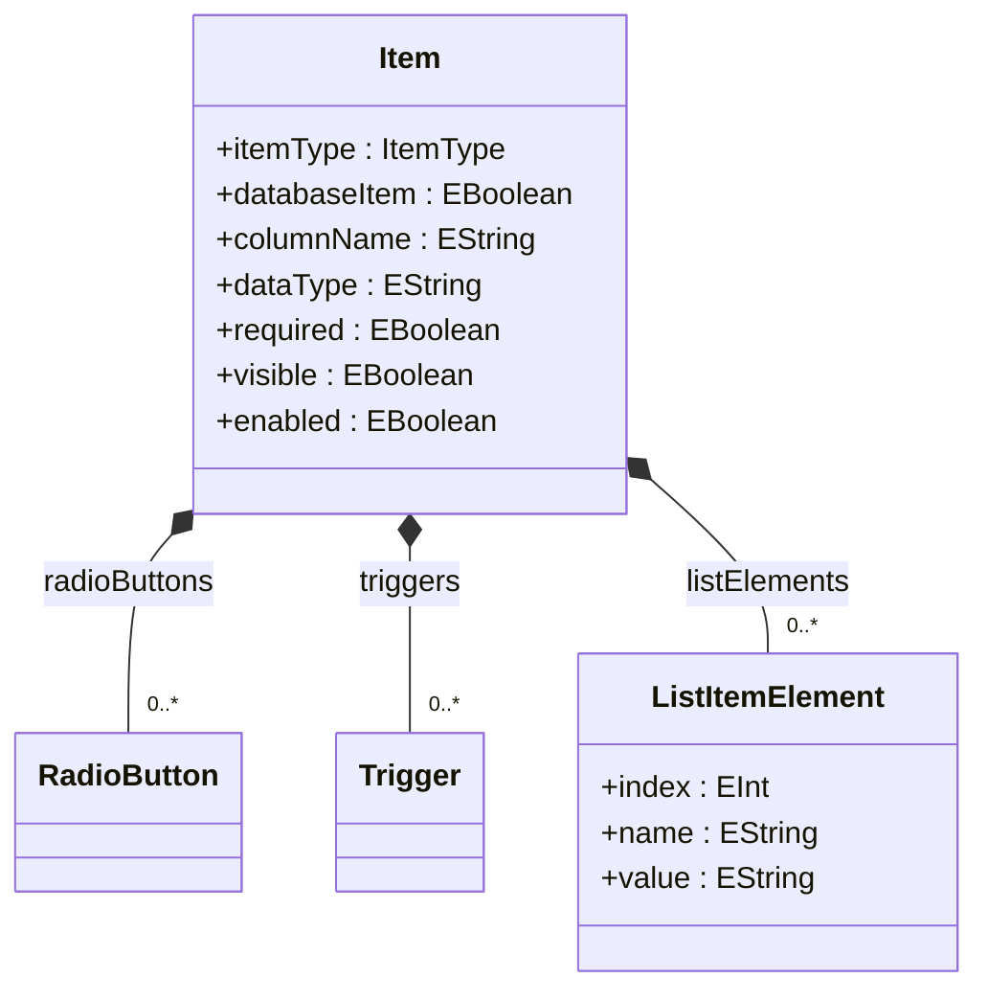

The XSD `ItemType` includes at least:

```text
Bean Area
Check Box
Display Item
Hierarchical Tree
Image
List Item
Push Button
Radio Group
Text Item
User Area
ActiveX Control
Chart Item
OLE Container
Sound
VBX Control
```

The semantic model should normalize both textual and numeric XSD aliases into one EEnum literal.

### Important Item references to resolve

The XSD represents these as strings; the semantic model should convert them into EReferences when the target exists:

```text
CanvasName                    -> Canvas
TabPageName                   -> TabPage
LovName                       -> LOV
RecordGroupName               -> RecordGroup
NextNavigationItemName        -> Item
PreviousNavigationItemName    -> Item
SynchronizedItemName          -> Item
SummaryBlockName              -> Block
SummaryItemName               -> Item
VisualAttributeName           -> VisualAttribute
```

## 10. Relation Model

The XSD places `Relation` inside `Block`.

The containing block is therefore the natural master block.

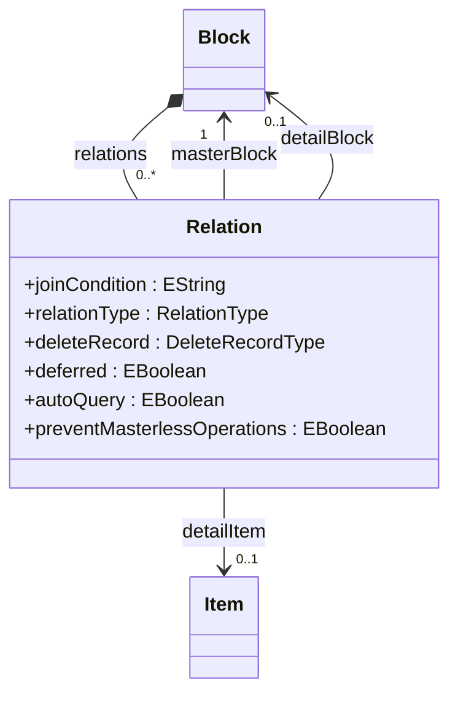

`masterBlock` is derived from containment; `detailBlock` is resolved from the XSD `DetailBlock` string.

XSD values include:

```text
RelationType: Join | Ref
DeleteRecord: Cascading | Isolated | Non Isolated
```

## 11. Canvas and Presentation Model

The previous model incorrectly implied that `Window` owns canvases. The XSD shows that both are direct children of `FormModule` and reference each other by name.

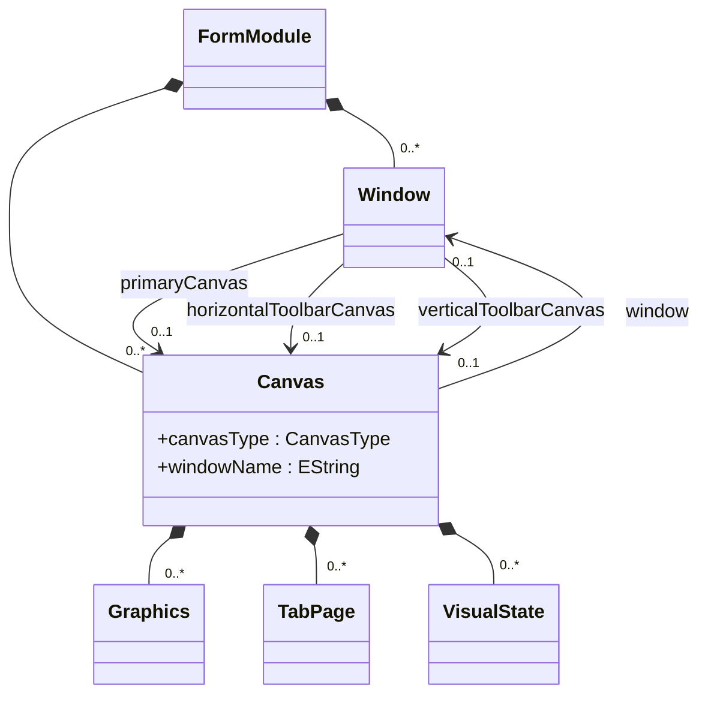

XSD `CanvasType` values include:

```text
Content
Stacked
Vertical Toolbar
Horizontal Toolbar
Tab
```

### Tab pages and graphics

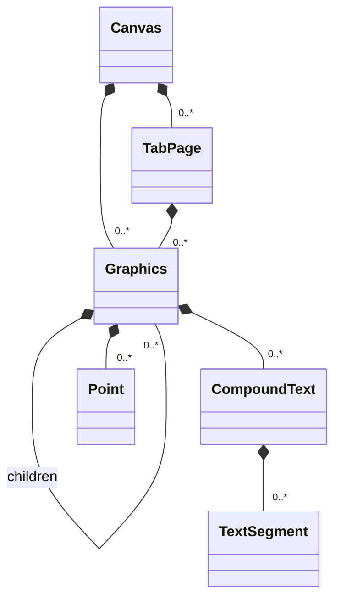

For the first dependency-analysis POC, detailed graphics can be imported but excluded from graph generation unless presentation analysis is required.

## 12. LOV and RecordGroup

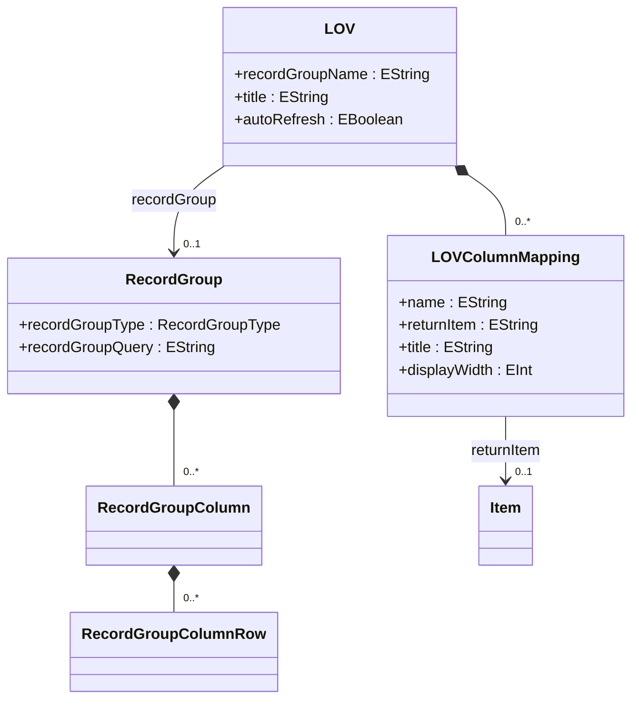

`RecordGroupQuery` is SQL text and should be analyzed separately from PL/SQL code.

## 13. Event and PropertyClass Triggers

The XSD shows that triggers can exist under more containers than originally modeled.

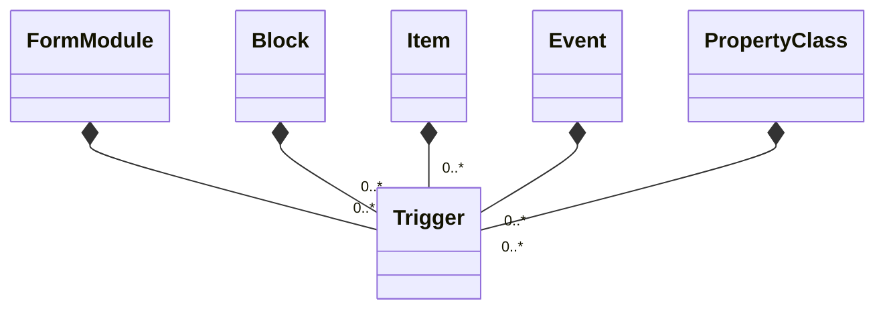

Do not encode trigger ownership using separate trigger classes. A single `Trigger` EClass plus EObject containment is sufficient.

## 14. Embedded PL/SQL Integration

The XSD exposes source code primarily through:

```text
Trigger.TriggerText
ProgramUnit.ProgramUnitText
```

Additional code or query-bearing attributes include:

```text
RecordGroup.RecordGroupQuery
Item.TreeDataQuery
MenuItem.MenuItemCode
MenuItem.CommandText
MenuModule.StartupCode
```

For the `.fmb` POC, prioritize `TriggerText` and `ProgramUnitText`.

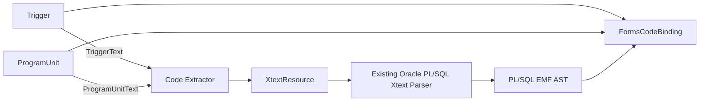

Recommended integration model:

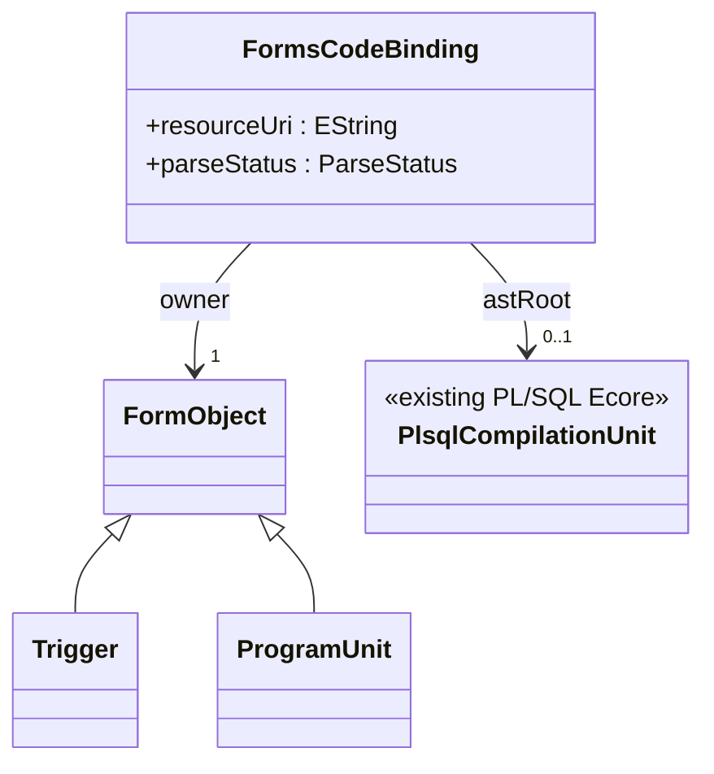

Do not embed the complete PL/SQL AST inside `OracleForms.ecore`.

## 15. Forms-specific PL/SQL Semantics

The existing PL/SQL parser should continue to own the AST. A Forms semantic layer should resolve constructs such as:

```text
:BLOCK.ITEM
:PARAMETER.NAME
:GLOBAL.NAME
:SYSTEM.NAME
```

and classify Forms built-ins such as:

```text
GO_BLOCK
GO_ITEM
EXECUTE_QUERY
COMMIT_FORM
CLEAR_FORM
DO_KEY
SET_ITEM_PROPERTY
SET_BLOCK_PROPERTY
SHOW_ALERT
```

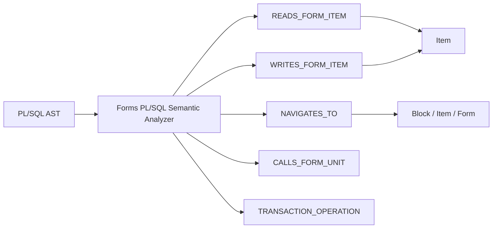

These are derived semantic relationships and belong in the analysis model, not in the source Ecore containment tree.

## 16. String References That Should Become EReferences

The XSD uses many name-based attributes. The semantic mapper/linker should resolve high-value references.

| XSD source | XSD attribute | Semantic target |
|---|---|---|
| `FormModule` | `FirstNavigationBlockName` | `Block` |
| `FormModule` | `HorizontalToolbarCanvas` | `Canvas` |
| `FormModule` | `VerticalToolbarCanvas` | `Canvas` |
| `Block` | `NextNavigationBlockName` | `Block` |
| `Block` | `PreviousNavigationBlockName` | `Block` |
| `Relation` | `DetailBlock` | `Block` |
| `Item` | `CanvasName` | `Canvas` |
| `Item` | `TabPageName` | `TabPage` |
| `Item` | `LovName` | `LOV` |
| `Item` | `RecordGroupName` | `RecordGroup` |
| `Item` | `NextNavigationItemName` | `Item` |
| `Item` | `PreviousNavigationItemName` | `Item` |
| `LOV` | `RecordGroupName` | `RecordGroup` |
| `LOVColumnMapping` | `ReturnItem` | `Item` |
| `Canvas` | `WindowName` | `Window` |
| `Window` | `PrimaryCanvas` | `Canvas` |
| `Window` | `HorizontalToolbarCanvasName` | `Canvas` |
| `Window` | `VerticalToolbarCanvasName` | `Canvas` |
| `Graphics` | `LayoutDataBlockName` | `Block` |
| `Graphics` | `TabPageName` | `TabPage` |
| `Report` | `DataSourceBlock` | `Block` |

Unresolved values should be retained as their original string plus a diagnostic; the importer should never discard them.

## 17. Property Strategy

The XSD is property-heavy. `Item` alone exposes more than 160 attributes, and `PropertyClass` references the large `JdapiProperties` attribute group.

A one-to-one hand-written semantic attribute model would be unnecessarily large.

Use three categories:

### Category A — typed semantic attributes

Promote properties that affect behavior or dependencies, for example:

```text
DatabaseBlock
QueryDataSourceType
QueryDataSourceName
DMLDataName
WhereClause
OrderByClause
ColumnName
DatabaseItem
ItemType
DataType
CanvasName
LovName
TriggerText
ProgramUnitText
RecordGroupQuery
JoinCondition
DetailBlock
```

### Category B — semantic references

Convert name properties into EReferences where possible.

### Category C — remaining raw properties

Keep them in the generated XSD model and optionally mirror required values into `FormProperty`.

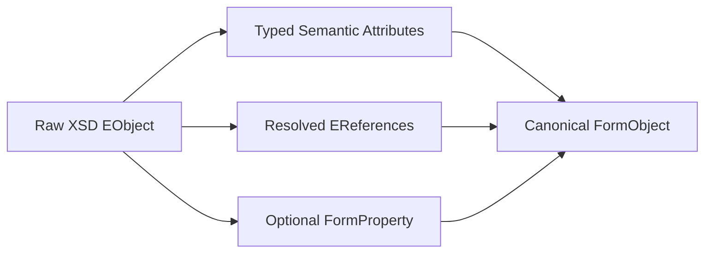

## 18. Enum Normalization

The XSD often allows both a textual value and a numeric representation for the same semantic value.

Examples:

```text
QueryDataSourceType:
  Table | 1
  Procedure | 2

ProgramUnitType:
  Procedure | 1
  Function | 2

CanvasType:
  Content | 0
  Stacked | 1
```

The raw model should preserve the XML value. The semantic mapper should normalize both forms to one EEnum literal.

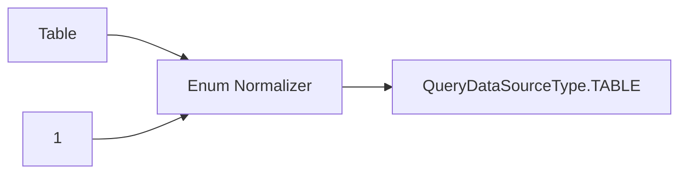

## 19. Package Architecture

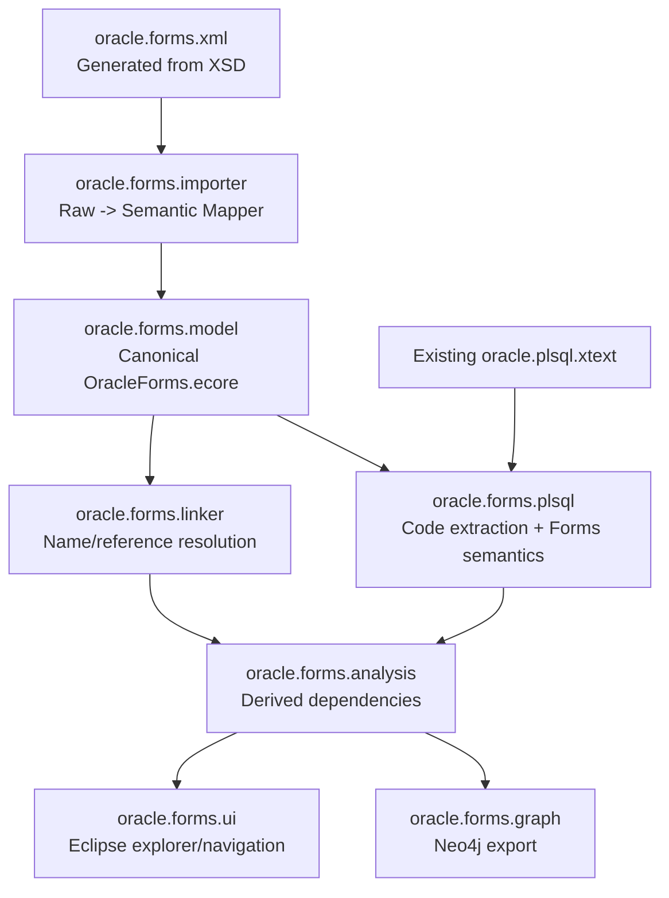

Suggested Eclipse projects:

```text
oracle.forms.xml
oracle.forms.model
oracle.forms.importer
oracle.forms.linker
oracle.forms.plsql
oracle.forms.analysis
oracle.forms.ui
oracle.forms.graph
```

## 20. Canonical Model Scope for the First POC

Implement first:

```text
FormModule
Coordinate
Block
DataSourceArgument
DataSourceColumn
Item
RadioButton
ListItemElement
Trigger
ProgramUnit
Relation
Canvas
TabPage
Window
LOV
LOVColumnMapping
RecordGroup
RecordGroupColumn
Alert
AttachedLibrary
ModuleParameter
VisualAttribute
```

Load but postpone semantic analysis for:

```text
Graphics
CompoundText
Point
VisualState
Editor
Event
Menu
ObjectGroup
PropertyClass
Report
```

The raw XSD model still preserves all of these, so postponing semantic mapping does not lose source information.

## 21. Target Unified Semantic Model

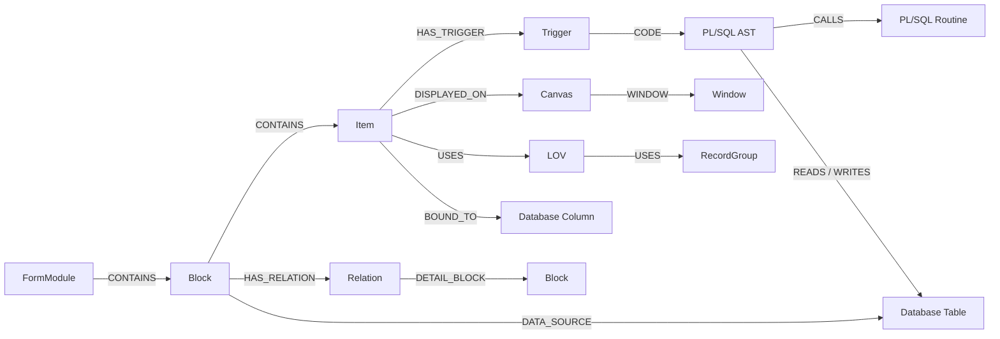

This is the model required for questions such as:

```text
Which Forms trigger invokes this package routine?
Which form items depend on this table column?
What happens if this package procedure changes?
Which Forms navigation paths reach this block?
Which Forms business flow writes to this table?
```

## 22. Architectural Decisions

| ADR | Decision |
|---|---|
| ADR-001 | Treat `frmf2xml` XML as an interchange/source format, not the canonical semantic model |
| ADR-002 | Generate a raw EMF model from `oracleforms.xsd` |
| ADR-003 | Maintain a separate curated `OracleForms.ecore` semantic model |
| ADR-004 | Map raw XSD EObjects to semantic EObjects using a dedicated mapper |
| ADR-005 | Preserve XSD containment where it represents actual Forms ownership |
| ADR-006 | Resolve name-based XSD attributes into semantic EReferences |
| ADR-007 | Keep unresolved original names and diagnostics |
| ADR-008 | Normalize textual/numeric XSD enum aliases in the semantic model |
| ADR-009 | Reuse the existing PL/SQL Xtext/Ecore model for `TriggerText` and `ProgramUnitText` |
| ADR-010 | Keep Forms-specific references and built-ins in a semantic-analysis layer |
| ADR-011 | Do not embed PL/SQL ASTs directly into `OracleForms.ecore` |
| ADR-012 | Keep UI containment (`Canvas`, `TabPage`, `Graphics`) separate from block/data containment |
| ADR-013 | Model `Relation` under its containing/master `Block` |
| ADR-014 | Link `Window` and `Canvas` through semantic references, not containment |
| ADR-015 | Keep complete property fidelity in the raw XSD model and only promote useful properties into the semantic model |

## 23. Recommended Processing Flow

```mermaid
sequenceDiagram
    participant CLI as frmf2xml
    participant XML as Forms XML
    participant EMF as Raw EMF Resource
    participant MAP as Semantic Mapper
    participant LINK as Forms Linker
    participant XTEXT as PL/SQL Xtext
    participant ANA as Analyzer

    CLI->>XML: Generate XML
    XML->>EMF: Deserialize using XSD-generated model
    EMF->>MAP: Raw EObjects
    MAP->>MAP: Normalize enums and properties
    MAP->>LINK: Canonical Forms model
    LINK->>LINK: Resolve Forms references
    LINK->>XTEXT: Extract TriggerText / ProgramUnitText
    XTEXT-->>ANA: PL/SQL AST
    LINK-->>ANA: Forms semantic model
    ANA->>ANA: Build dependencies and impact relationships
```

## 24. Final Recommendation

Use the XSD as the **serialization contract** and generate an EMF raw model from it, but do not make that generated Ecore the long-term domain model.

The canonical `OracleForms.ecore` should represent the concepts needed for analysis and modernization, while the generated XSD model provides complete source fidelity. This architecture gives a clean separation between:

```text
Oracle XML representation
        ↓
Raw XSD-backed EMF model
        ↓
Canonical Forms semantic model
        ↓
Existing PL/SQL Xtext model
        ↓
Cross-language dependency analysis
```

This also minimizes custom XML parsing code, prevents the canonical model from becoming a 500-property mirror of JDAPI, and provides a stable foundation for Eclipse navigation, impact analysis, Neo4j export, and future Oracle Forms migration tooling.
