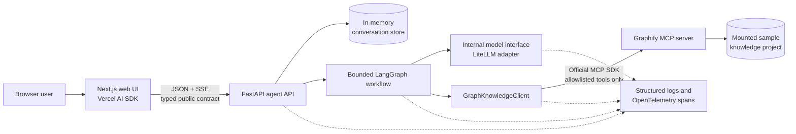
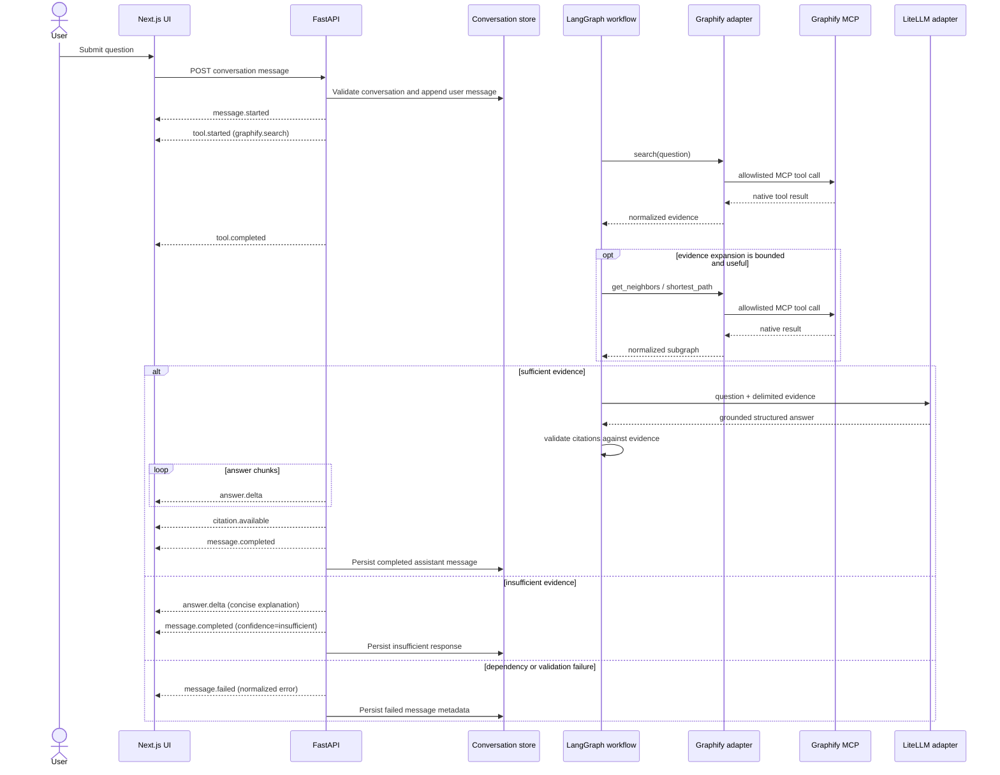

# Graphify Knowledge Agent POC Architecture

Status: initial contracts frozen on 2026-07-28.

## Scope and assumptions

This POC exposes an unauthenticated browser chat over a FastAPI backend. The
backend is the sole caller of Graphify MCP and the model provider. Conversations
live in API process memory and are lost on restart. A single configured Graphify
project is available per deployment. Graphify and the LLM are real production
adapters; deterministic substitutes are enabled only by explicit test or
troubleshooting configuration.

## Components

The browser has no Graphify URL or LLM credentials. Public models in
`contracts/schemas` contain normalized graph evidence and never MCP-native
payloads.

## Runtime interaction

## Boundaries

- `apps/web` owns presentation, browser-session conversation selection, Markdown
  rendering, and validated consumption of public contracts.
- `apps/api/app/api`, `models`, and `config` own HTTP/SSE, validation, request
  correlation, configuration, and conversation persistence.
- `apps/api/app/agent` owns bounded orchestration and grounding policy.
- `apps/api/app/integrations/graphify` alone understands Graphify MCP schemas.
- `apps/api/app/integrations/llm` alone understands LiteLLM/provider behavior.
- `contracts` is descriptive and frozen for the initial POC. Runtime types should
  conform to it; contract changes require an ADR and coordinated frontend/backend
  update.

## Failure and readiness model

`/health` reports process liveness. `/ready` confirms application initialization,
conversation store availability, and Graphify adapter configuration. It may
report dependency details without requiring a live LLM request. Per-message
Graphify, MCP, LLM, timeout, malformed-response, and interrupted-stream failures
use the normalized `message.failed` contract.

## Grounding and safety invariants

1. Only the four operations in the MCP contract are callable.
2. Project ID and project path come only from trusted configuration.
3. Retrieved graph content is untrusted data, delimited from model instructions.
4. Tool calls, traversal depth, evidence bytes, nodes, edges, model iterations,
   and total time are bounded by backend configuration.
5. A returned citation must match retrieved evidence; invalid citations are
   removed and may force `confidence=insufficient`.
6. No private reasoning or chain-of-thought is included in events or logs.

