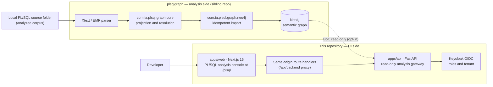
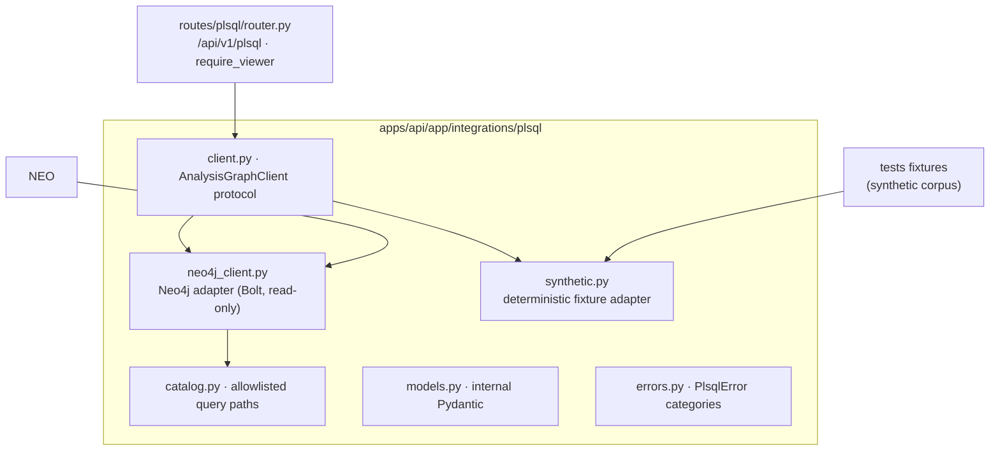

# PL/SQL Dependency and Impact Analysis — Console Architecture

Status: updated 2026-09-04 for implementation in this repository. This document
updates the source proposal
[`arch/PL-SQL Dependency and Impact Analysis Architecture (1).md`](../../arch/PL-SQL%20Dependency%20and%20Impact%20Analysis%20Architecture%20(1).md)
so the UI and its access layer match this repository's actual stack,
conventions, and the current state of the analysis graph. The analysis engine
lives in the sibling repository `/home/oortiz/oao/plsqlgraph`; this repository
is the **UI side**: the authenticated Next.js console plus the FastAPI read-only
analysis gateway it talks to.

Architecture decisions for this update are recorded in
[ADR 0011](../adr/0011-plsql-analysis-console-workspace.md) through
[ADR 0015](../adr/0015-plsql-console-runtime-and-test-topology.md).

## 1. Scope and ownership



- `plsqlgraph` owns parsing (Xtext/EMF), semantic projection, dependency
  resolution, and Neo4j synchronization. This repository never parses PL/SQL
  and never writes to the graph.
- `apps/api` owns the only path from this product to the graph: a read-only
  gateway with deterministic, allowlisted query paths (ADR 0012).
- `apps/web` owns the developer console presentation and browser contract
  validation (ADR 0011, ADR 0013, ADR 0014).
- The upstream MCP server exists but is **out of scope** for this phase; the
  console and gateway do not depend on it.

## 2. Principles

From the source document, kept:

1. Parsing, semantic analysis, graph persistence, and UI concerns stay
   separated; analysis and UI live in different repositories.
2. The configured analyzed source folder is the authoritative source of
   PL/SQL code; the graph stores coordinates, not code.
3. The UI exposes developer operations, never generic graph queries.
4. Impact analysis and path traversal are bounded and explainable.
5. Static-analysis uncertainty is represented explicitly and never shown as
   certainty.
6. Full indexing first; incremental analysis comes later, after semantic
   correctness is stable.

Adapted to this repository:

7. **Deterministic first.** The gateway exposes only allowlisted, reviewed,
   parameterized query paths (a deterministic catalog) and runs a fixture
   `synthetic` mode for development and E2E. No user- or model-supplied Cypher
   reaches Neo4j (ADR 0012).
8. **Read-only gateway.** The browser never receives Neo4j credentials or raw
   query results; the gateway opens read-only sessions, enforces row/hop/time
   bounds, and reports truncation explicitly (ADR 0012, ADR 0015).
9. **Textual evidence is mandatory.** Structured text views (`source →
   relationship → target`, ordered paths, resolution badges) are the
   source-of-truth presentation; an interactive graph may come later only as a
   redundant enhancement (ADR 0014).
10. **Follow the implemented graph.** Public vocabulary and evidence follow
    what `plsqlgraph` actually persists (relationship types, `resolution`
    enum, source coordinates) rather than the older draft vocabulary (see
    §5), because contracts must match the executable graph.

## 3. Runtime topology

- Default Compose in this repository is unchanged; the analysis feature is
  disabled (`PLSQL_ADAPTER=disabled`) and the console shows an explicit
  "Analysis is not configured" state.
- `PLSQL_ADAPTER=synthetic` selects the deterministic fixture adapter — the
  development and E2E surface, exercised through the existing
  `docker-compose.synthetic.yml` overlay (ADR 0015).
- `PLSQL_ADAPTER=neo4j` connects to an already-synchronized graph over Bolt
  using server-side environment credentials and a configured
  `PLSQL_PROJECT_ID`; the source root is mounted read-only when
  containerized.
- `/ready` reports one of `disabled | synthetic | connected | unavailable`
  for the analysis subsystem without exposing connection details.

## 4. Capabilities and query mapping

| Console capability | Gateway operation | Graph query path (allowlisted, parameterized) | Bounds |
| --- | --- | --- | --- |
| Object search / detail | `search_objects`, `get_object` | Label-filtered lookup on `name`/`qualifiedName`; deterministic ordering | `PLSQL_MAX_ROWS` ≤ 200, truncation flag |
| Callers of a routine | `callers_of` | `CALLS` into the target by `qualifiedName` (upstream `CALLERS_OF_ROUTINE`) | rows capped |
| Callees of a routine | `callees_of` | Inverse reviewed path — `CALLS` out of the routine (added to the local catalog; not in upstream catalog) | rows capped |
| Table access by object/package | `table_access_of` | `READS`/`WRITES` of contained units (upstream `TABLE_ACCESS_BY_PACKAGE`) | rows capped |
| Transitive impact | `impact_of` | `READS`, `WRITES`, `VIEW_DEPENDS_ON`, or `CALLS` up to 5 hops into the changed object (upstream `REVERSE_IMPACT`) | `PLSQL_MAX_HOPS` = 5 |
| Dependency paths | `find_paths` | Bounded variable-length paths over the same typed relationships, `from`/`to` by id | hop and row caps, ordered output |
| Unresolved/ambiguous | `unresolved_references` | `resolution IN (AMBIGUOUS, UNRESOLVED)` edges (upstream query) | rows capped |
| Relationship evidence | `relationship_evidence` | Read edge properties (`sourceFileId`, offsets, lines, `evidenceKind`) | single record |
| Source view | `object_source` | Resolve `SourceFile.path` + coordinates to read-only content under the configured source root | file size cap, traversal guard |

Every envelope is `{items, truncated}` (plus optional `count`), results are
deterministic for a fixed graph and catalog version, and each operation has a
timeout. Capability gaps of the upstream catalog (callees, name search,
shortest path) are filled only by reviewed, parameterized local catalog
entries so both repositories can converge later (ADR 0012).

## 5. Consumed graph model

The gateway and contracts consume the graph as persisted today by
`plsqlgraph` (`com.ia.plsql.graph.neo4j` + `com.ia.plsql.graph.core`).

- Nodes: `Project`, `SourceFile` (`path`), `DatabaseObject` with one kind label
  (`Table`, `View`, `Package`, `Sequence`, `Trigger`, `Index`, `Synonym`,
  `Type`), `ExecutableUnit` + `Procedure`/`Function` (also `DatabaseObject`),
  and `AnonymousBlock`. Package/routine spec+body pairs share one node.
- Relationships: `CONTAINS`, `DECLARES`, `CALLS`, `READS`, `WRITES`,
  `VIEW_DEPENDS_ON`, `TRIGGER_ON`, `INDEXES`, `SYNONYM_FOR` — directed, with
  edge properties `resolution`, `sourceFileId`, `startOffset`, `endOffset`,
  `startLine`, `startColumn`, `evidenceKind`, `sourceRole`.
- Resolution states: `EXACT`, `INFERRED`, `AMBIGUOUS`, `UNRESOLVED`; no
  numeric confidence is stored and the product must not invent one.
- Identifiers are opaque to clients: `project://…`, `file://…`,
  `plsql://<project>/<SCHEMA>/<TYPE>/<NAME>` (routines append an ordered
  signature `(NUMBER,VARCHAR2)`), `edge://…`.

### Divergences from the source document (deliberate)

| Source document (§5, §6, §24) | Implemented graph → contract uses | Why |
| --- | --- | --- |
| `READS`, `INSERTS`, `UPDATES`, `DELETES` | `READS` + one `WRITES` relationship (DML target; MERGE source is `READS`) | The extractor collapses DML into `WRITES`; contracts match the graph |
| numeric `confidence` (0–1) | `resolution` enum only (`EXACT/INFERRED/AMBIGUOUS/UNRESOLVED`) | No confidence is persisted; inventing one would violate the determinism/uncertainty principles |
| `SourceCoordinate` with `endLine`/`endColumn` | `startLine`, `startColumn`, `startOffset`, `endOffset` (+ `sourceFileId`) | The implemented `SourceEvidence` and edge properties carry these fields |
| Graph as the source of code | Graph holds coordinates only; raw text is served by the source endpoint from the configured root | Preserves privacy and keeps the graph lean |

## 6. Source evidence and navigation

- Every node/edge answer carries evidence coordinates when the graph has
  them; the UI renders them as file path + line (e.g.
  `packages/FA_QMORA.pkb:125`) and links to the source view.
- The source view requests read-only content from the gateway through
  identifier query parameters (future `objectId`/`fileId` endpoints), which
  resolves the project-relative path strictly under the configured
  `PLSQL_SOURCE_ROOT` (traversal guarded). The viewer scrolls to and
  highlights the requested range with line numbers; no code editor dependency
  (ADR 0014).
- Browser navigation never constructs filesystem paths: it passes opaque
  object/file ids and lets the server resolve them.

## 7. Public contract

Domain-oriented, camelCase, additive-first surface under
`/api/v1/plsql` (full shape in ADR 0013):

```text
GET  /api/v1/plsql/objects            ?q=…            search objects
GET  /api/v1/plsql/object             ?objectId=…     object detail
GET  /api/v1/plsql/callers            ?objectId=…     incoming CALLS
GET  /api/v1/plsql/callees            ?objectId=…     outgoing CALLS
GET  /api/v1/plsql/table-access       ?objectId=…     READS/WRITES grouped
GET  /api/v1/plsql/impact             ?objectId=…     bounded transitive impact
GET  /api/v1/plsql/source             ?objectId=…     read-only source text
GET  /api/v1/plsql/files              ?fileId=…       read-only source text by file id
GET  /api/v1/plsql/paths              ?from=…&to=…    bounded dependency paths
GET  /api/v1/plsql/relationships/evidence ?relationshipId=…   evidence coordinates
GET  /api/v1/plsql/unresolved                          ambiguous/unresolved edges
```

Identifiers embed `/` characters, so identifier-carrying endpoints take them
as query parameters (`objectId`, `relationshipId`) instead of path segments
(ADR 0013).

Result models (Pydantic `ApiModel` with camel aliases ↔ Zod `contracts.ts`
schemas ↔ `contracts/` JSON Schema): object summary/detail, typed dependency
with resolution, table-access groups, ordered path, impact report with
explaining paths, source response, and bounded envelopes carrying
`truncated`. Every payload item keeps optional `sourceFileId`, `startLine`,
`startColumn`, `startOffset`, `endOffset`, `evidenceKind` when present.

## 8. Gateway architecture



- Selection by settings `plsql_adapter` via a `build_analysis_client(settings)`
  factory in `apps/api/app/api/dependencies.py`; the client is composed in
  `create_app` and attached to `request.app.state`, mirroring how the workflow
  and graph client are composed today.
- The Neo4j adapter enforces read-only sessions, parameterized queries from
  `catalog.py`, row/hop/time limits, and normalizes driver errors to
  `PlsqlError` categories (`unavailable`, `timeout`, `limit_exceeded`,
  `invalid_response`, `configuration`, `not_found`), so route code and tests
  never see driver exceptions.
- Routes translate internal models to public camelCase models and register
  specific error handlers; new problem codes are added to the `Problem` code
  literal in `apps/api/app/models/system.py` additively, together with the
  OpenAPI sync (ADR 0013).
- The synthetic adapter is deterministic: it serves an in-repo fixture corpus
  (minimal synthetic PL/SQL objects — no proprietary sources), which is what
  API tests, web tests, and Playwright E2E assert against.

## 9. UI architecture

```text
apps/web/src/app/plsql/page.tsx          thin Server Component
apps/web/src/components/plsql-analysis/
  plsql-analysis-workspace.tsx           client workspace (AuthProvider + ApplicationShell)
  analysis-status.tsx                    disabled | unavailable | degraded banner
  object-search.tsx                      search box + results (text first)
  object-detail.tsx                      selected object: summary + section nav
  dependency-list.tsx                    callers/callees/table access, typed edges
  path-list.tsx                          ordered dependency paths
  impact-report.tsx                      grouped impact with explaining paths
  source-viewer.tsx                      read-only file view + range highlight
```

- One visible page heading per screen; left navigation gains the console entry
  in `ApplicationNavigation` (`application-shell.tsx`) next to Projects; small
  screens reuse the existing Sheet drawer.
- Data flow follows the chat surface: client components call typed functions
  in `apps/web/src/lib/api.ts` (`searchPlsqlObjects`, `getPlsqlObject`,
  `listPlsqlCallers`, `listPlsqlCallees`, `getPlsqlTableAccess`,
  `analyzePlsqlImpact`, `findPlsqlPaths`, `getPlsqlObjectSource`) over
  `/api/backend/api/v1/plsql/...`, with every payload validated by Zod
  schemas in `apps/web/src/lib/contracts.ts` before rendering.
- Presentation is textual-first (ADR 0014): edges render
  `source → relationship → target` with a resolution badge
  (`EXACT/INFERRED/AMBIGUOUS/UNRESOLVED`); paths are ordered lists; impact is
  grouped with its explaining paths; `truncated` and unresolved items are
  visible and never hidden to fix layout.
- States: not-configured, unavailable (retry), loading, empty, error
  (`role="alert"`, recovery named), and data — following
  `docs/ui/ui-guidelines.md` and `docs/ui/interaction-states.md`. No critical
  control depends on hover; test at 320px width and 200% zoom; ≥44px targets;
  keyboard reachable; WCAG 2.2 AA.

## 10. Security and boundary invariants

1. The browser never receives Neo4j credentials, Cypher, raw MCP payloads, or
   filesystem paths; it receives only validated public models.
2. Only allowlisted, parameterized query paths from `catalog.py` execute;
   `PLSQL_PROJECT_ID` and the source root are server configuration, never
   client or model input (mirrors the Graphify allowlist invariant).
3. The gateway is read-only by construction and enforces session read mode,
   bounds, and timeouts; impact/path hops ≤ 5 and rows ≤ 200 by default.
4. Source content is resolved strictly under the configured read-only root
   with traversal guards and per-file size caps.
5. Provider/database exception bodies stay server-side; public errors are
   normalized categories plus `requestId`.
6. Uncertainty is explicit: `AMBIGUOUS`/`UNRESOLVED` edges and truncation are
   rendered, never inferred away or presented as certain.
7. No user or model output is rendered as trusted raw HTML.

## 11. Testing strategy

- **API/unit** (`apps/api/tests/plsql/`): protocol-level fakes, catalog unit
  tests against recorded fixture graphs, router tests over
  `httpx.ASGITransport` with `PLSQL_ADAPTER=synthetic`, bounds/truncation
  tests, and read-only/traversal-guard tests for the source endpoint.
- **Web** (`apps/web/src/components/plsql-analysis/*.test.tsx`): mock
  `@/lib/api`; assert accessible names, ordering, resolution badges,
  truncation notices, and state transitions.
- **E2E** (`tests/e2e/specs/plsql-analysis.spec.ts`): runs with the synthetic
  overlay (`PLSQL_ADAPTER=synthetic`, `PLSQL_ENABLED=true`) as part of the
  deterministic suite (`npm run test:synthetic`, also standalone via
  `npm run test:plsql`) and verifies search → detail → callers/callees →
  table access → dependency paths → source evidence → unresolved references →
  impact over committed fixture facts.
- **Real-graph verification** is an explicit, documented developer step against
  a `plsqlgraph`-synchronized Neo4j (`PLSQL_ADAPTER=neo4j`); it is never part
  of `make e2e`.

## 12. MVP scope and phases

MVP capabilities (mapped to the
[implementation plan](../plsql-analysis/implementation-plan.md)):

1. Search packages, routines, tables, views, triggers (phase 1).
2. Show callers and callees with typed edges and resolution (phase 2).
3. Show table `READS`/`WRITES` grouping (phase 2).
4. Bounded dependency paths and transitive impact with explaining paths
   (phases 3 and 5).
5. Navigate to exact read-only source with range highlight (phase 4).
6. Show ambiguous/unresolved references (phase 3).
7. Deterministic synthetic mode and E2E for all of the above (all phases).

Interactive graph visualization (Cytoscape.js) and advanced source editing are
explicitly **not** in the MVP (ADR 0014).

Implementation status is tracked in the
[implementation plan](../plsql-analysis/implementation-plan.md): phases 0–5
are shipped and verified, and phase 6 (hardening) is complete — bounds sweep
for rows/hops/bytes/timeout, the readiness matrix, the accessibility pass
(polite live region, focus management on detail/source open and back/close,
≥44px targets, wrapping at 320px, aligned accessible names), the full
synthetic E2E spec above, and the documentation sync. No contract artifact
changed in phase 6. The `neo4j` adapter (dependency decision recorded in the
[implementation plan](../plsql-analysis/implementation-plan.md) §0.1) is now
implemented behind the confirmed `neo4j` 5.x driver: read-only Bolt sessions, the
allowlisted parameterized catalog (`app/integrations/plsql/catalog.py`), the
`AnalysisGraphClient` implementation (`neo4j_client.py`), normalized
`connected`/`unavailable` readiness, and skip-gated real-graph integration
tests; the remaining step is schema alignment against a first live
`plsqlgraph`-synchronized instance.

## 13. ADRs

| ADR | Decision |
| --- | --- |
| [0011](../adr/0011-plsql-analysis-console-workspace.md) | Authenticated `/plsql` workspace in the existing shell |
| [0012](../adr/0012-plsql-read-only-analysis-gateway.md) | Deterministic read-only gateway; no MCP, no raw Cypher |
| [0013](../adr/0013-plsql-analysis-contract.md) | Contract, evidence, and identifier rules |
| [0014](../adr/0014-plsql-textual-first-ui-deferred-graph.md) | Textual-first UI; graph and editor deferred |
| [0015](../adr/0015-plsql-console-runtime-and-test-topology.md) | Runtime and test topology |

## 14. What changed versus the source document

- Repositories are explicit: analysis engine (`plsqlgraph`) vs UI side (this
  repo); the React UI, REST surface, and access layer are implemented here,
  while parsing/graph persistence remain in `plsqlgraph`.
- The REST API is produced by this repo's FastAPI gateway rather than by
  `plsqlgraph`; the upstream MCP server is out of scope for this phase
  (ADR 0012).
- Neo4j is reached read-only over Bolt through a deterministic allowlisted
  catalog; generic neighborhood browsing is deferred until paths are stable.
- Relationship and evidence vocabulary follows the implemented graph
  (`WRITES`, `resolution` enum, stored coordinates only) — §5.
- Graph visualization is deferred behind the repo's mandatory-textual-evidence
  rules and its dependency-confirmation policy (ADR 0014).
- Source viewer MVP is a dependency-free read-only viewer; Monaco/CodeMirror
  evaluation is deferred (ADR 0014).
- Runtime integration is additive and disabled by default; deterministic
  synthetic mode is the dev/E2E surface (ADR 0015).

## 15. Future extensions

Allowed but not implemented now, reusing the same gateway/contract/UI seams:
MCP access parity for agents (after the UI contract stabilizes), incremental
analysis and content hashes (upstream), source-editor and interactive-graph
adoption after spikes, Git/PR-aware source repositories, revision comparison,
column-level lineage, control-flow views, trigger chains, and per-project
multi-graph support (replacing the single configured corpus).

## 16. Assumptions and open questions

- The analyzed corpus exists and is synchronized by `plsqlgraph` before real
  mode is exercised; graph schema/`resolution` semantics may evolve there and
  the catalog and fixtures must be updated in lockstep (contracts are pinned
  to the surveyed schema of 2026-09-04).
- Dependency extraction (`CALLS`/`READS`/`WRITES`/…) is upstream "remaining
  POC work"; until it lands, real graphs contain declarations only and
  deterministic fixtures carry the dependency behavior under test.
- The official Python `neo4j` driver is a confirmed dependency for the real
  adapter (see the implementation plan §0.1 for the confirmation record); the
  synthetic mode does not depend on it. Schema alignment against a first live
  `plsqlgraph`-synchronized instance is the remaining open item (§12).
