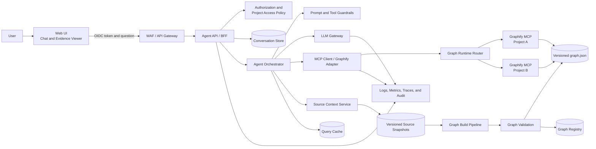
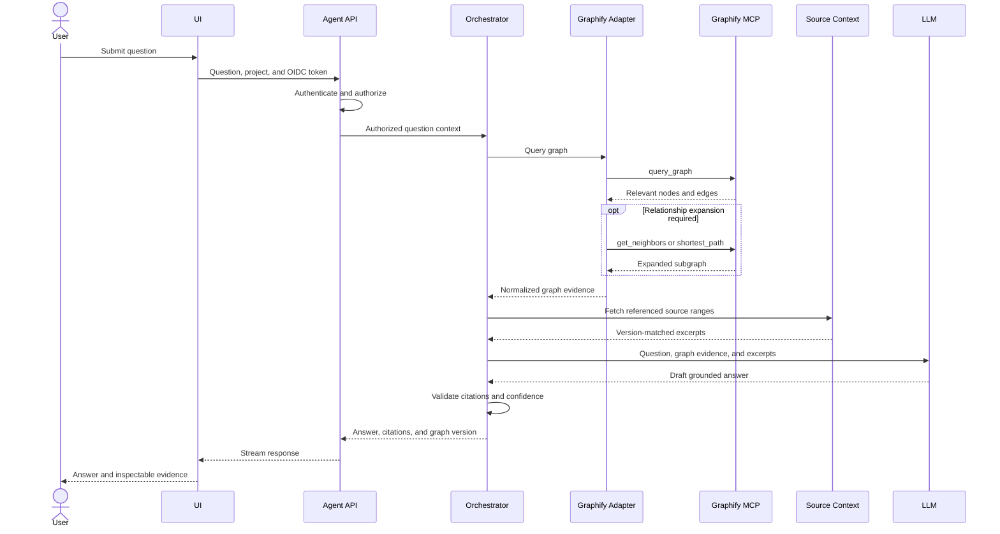
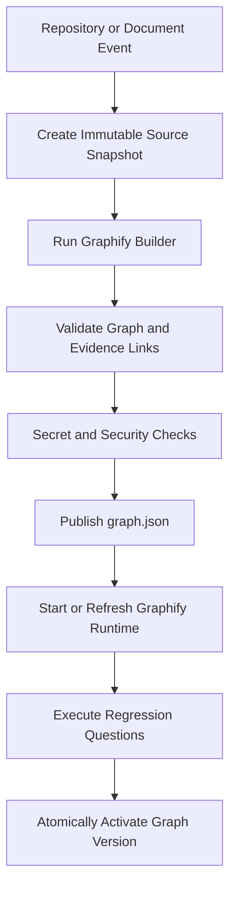

# Graphify Knowledge Agent — Solution Architecture

## 1. Purpose

This document proposes an architecture for exposing a web-based conversational agent that answers questions using knowledge stored in Graphify.

The solution treats Graphify as a read-only knowledge retrieval subsystem behind an authenticated application backend. The UI does not connect directly to Graphify or its MCP server.

## 2. Architecture principles

1. Do not expose Graphify directly to the browser.
2. Authenticate users using OIDC and authorize access at the project or knowledge-domain level.
3. Use a bounded agent workflow instead of an unrestricted autonomous agent.
4. Access Graphify through an internal MCP adapter.
5. Version the Graphify graph and its source snapshot together.
6. Retrieve exact source excerpts in addition to graph relationships.
7. Require evidence and citations for material claims.
8. Treat graph data, source code, documents, and comments as untrusted input.
9. Keep the public API independent from Graphify-native MCP contracts.
10. Support atomic graph-version activation and rollback.

## 3. High-level architecture



## 4. Recommended open-source stack

| Layer | Recommended tool | Responsibility |
|---|---|---|
| Web UI | Next.js and React | Conversational UI, project selection, source visualization, feedback |
| Chat integration | Vercel AI SDK | Streaming responses and tool-call visualization |
| Backend / BFF | FastAPI | Authentication integration, public APIs, streaming, validation |
| Agent orchestration | LangGraph | Stateful and bounded agent workflow |
| MCP integration | Official MCP Python SDK | Communication with the Graphify MCP server |
| Knowledge graph | Graphify | Knowledge graph generation and graph retrieval tools |
| LLM gateway | LiteLLM Proxy | Model abstraction, routing, quotas, and fallback |
| Identity | Keycloak | OIDC, OAuth 2.0, SSO, users, groups, and roles |
| Policy authorization | Open Policy Agent | Centralized project and tenant authorization policies |
| Relational persistence | PostgreSQL | Conversations, feedback, graph registry, project mappings |
| Cache | Valkey | Query caching, rate limiting, and temporary state |
| LLM observability | Langfuse | LLM traces, prompts, sessions, and evaluations |
| Distributed telemetry | OpenTelemetry | End-to-end tracing, metrics, and logs |
| Evaluation | Ragas and pytest | Retrieval, grounding, correctness, and regression testing |
| Monitoring | Prometheus and Grafana | Operational metrics, dashboards, and alerting |
| Local deployment | Docker Compose | Development and initial proof of concept |
| Production deployment | Kubernetes and Helm | Scaling, isolation, resiliency, and controlled releases |

## 5. Component responsibilities

### 5.1 Web UI

The UI provides:

- Conversational chat.
- Streaming answers.
- Project or knowledge-domain selection.
- Conversation history.
- Source citations.
- Graph-path visualization.
- Tool-execution status.
- User feedback.
- Evidence-confidence indicators.
- Warnings when an answer relies on inferred relationships.

The UI should present the answer together with:

- Source file or document.
- Relevant lines or section.
- Graph nodes and relationships used.
- Graph version.
- Source commit or document snapshot.
- Evidence provenance.

### 5.2 Agent API / BFF

The BFF is the only backend exposed to the browser.

Responsibilities:

- Validate OIDC access tokens.
- Resolve user identity, tenant, roles, and authorized projects.
- Create and manage conversation sessions.
- Enforce rate limits and quotas.
- Stream agent responses using Server-Sent Events or WebSockets.
- Normalize errors.
- Add correlation and audit identifiers.
- Prevent direct access to internal MCP services.

The BFF must not pass the end-user token directly to Graphify. Internal service communication should use workload identity or service credentials.

### 5.3 Agent orchestrator

The orchestrator controls question processing through an explicit workflow.

Recommended workflow:

```text
authorize_project
      ↓
classify_question
      ↓
select_graph_version
      ↓
query_graphify
      ↓
expand_graph_results
      ↓
retrieve_source_evidence
      ↓
generate_answer
      ↓
validate_citations
      ↓
return_response
```

The orchestrator should:

- Limit the number of tool calls.
- Restrict tools to an explicit allowlist.
- Enforce graph traversal depth and result-size limits.
- Require citations for factual claims.
- Return `insufficient evidence` when the answer cannot be supported.
- Record the model, prompt, graph version, and source version used.

### 5.4 Graphify MCP adapter

The adapter hides Graphify-native contracts from the rest of the application.

Responsibilities:

- Maintain the list of permitted MCP tools.
- Translate application requests into MCP calls.
- Enforce timeouts.
- Restrict traversal depth.
- Restrict node and edge counts.
- Reject arbitrary project paths.
- Normalize Graphify responses.
- Attach tenant, project, and graph-version metadata.
- Cache deterministic graph queries.
- Record tool calls for audit and tracing.

Example internal interface:

```python
class GraphKnowledgeClient:
    async def query(self, project_id: str, question: str): ...

    async def get_node(self, project_id: str, node_id: str): ...

    async def get_neighbors(
        self,
        project_id: str,
        node_id: str,
        depth: int = 1,
    ): ...

    async def shortest_path(
        self,
        project_id: str,
        source: str,
        target: str,
    ): ...
```

### 5.5 Source Context Service

Graph relationships are not always sufficient to answer a question precisely. The Source Context Service retrieves exact source passages referenced by the graph.

Example flow:

1. Graphify identifies that `OrderController` calls `OrderService`.
2. The graph edge points to a source location.
3. The Source Context Service retrieves the relevant lines.
4. The LLM receives the graph path and the exact implementation.
5. The UI shows a verifiable citation.

The graph and source snapshot must share an immutable version relationship:

```yaml
projectId: project-a
graphVersion: 2026-07-28-7f3a91c
sourceCommitSha: 7f3a91c
artifactUri: s3://knowledge-graphs/project-a/2026-07-28-7f3a91c/graph.json
createdAt: 2026-07-28T20:00:00Z
status: ACTIVE
```

### 5.6 LLM gateway

LiteLLM should sit between the agent and the model provider.

```text
Agent Orchestrator
        ↓
     LiteLLM
        ↓
OpenAI / Azure OpenAI / Anthropic / Local Model
```

Responsibilities:

- Present a consistent OpenAI-compatible API.
- Route requests by environment, tenant, or classification.
- Apply quotas and budgets.
- Support retries and fallback models.
- Capture model usage and latency.
- Prevent model-provider dependencies from leaking into agent code.

### 5.7 Persistence

PostgreSQL stores:

- Conversations.
- Messages.
- User feedback.
- Project mappings.
- Graph versions.
- Source versions.
- Evaluation datasets.
- Audit metadata.

Valkey stores:

- Query results.
- Rate-limit counters.
- Temporary agent state.
- Short-lived conversation context.
- Graph-version-aware cache entries.

## 6. Question execution flow



## 7. Knowledge ingestion and graph publication

Graph creation should run asynchronously from question execution.

### 7.1 Triggers

Run the graph pipeline after:

- Merge to a protected branch.
- Release creation.
- Documentation publication.
- Manual administrator request.
- Scheduled refresh for external sources.

### 7.2 Pipeline



### 7.3 Validation gates

Before activating a graph version, verify:

- `graph.json` is valid and readable.
- Node and edge counts are within expected ranges.
- Required domains and modules exist.
- Referenced source files exist.
- Source commit matches the graph version.
- No secrets are present in graph metadata.
- Confidence distribution has not degraded unexpectedly.
- Regression questions meet quality thresholds.
- Runtime health checks succeed.

Use an atomic active-version pointer:

```yaml
project-a:
  activeGraphVersion: 2026-07-28-7f3a91c
  previousGraphVersion: 2026-07-27-1ac892e
```

If validation or runtime activation fails, continue serving the previous graph.

## 8. Multi-project and multi-tenant isolation

### 8.1 Recommended model

Deploy one Graphify runtime per tenant, project, or trust boundary.

```text
Tenant A → Graphify Runtime A → Graph A
Tenant B → Graphify Runtime B → Graph B
```

Advantages:

- Strong isolation.
- Simple authorization.
- Smaller blast radius.
- Easier graph replacement.
- Reduced risk of cross-project retrieval.

### 8.2 Shared runtime option

A shared runtime may be used for many small projects with the same classification.

Required controls:

- Project selection occurs only in trusted backend code.
- The model cannot provide arbitrary filesystem paths.
- An explicit project-to-artifact mapping is maintained.
- Authorization is checked before every query.
- Tenant and project are included in every audit event.

## 9. Security architecture

### 9.1 Authentication

Use OIDC authorization-code flow with PKCE for the web UI.

Keycloak responsibilities:

- User authentication.
- SSO.
- Groups and roles.
- Token issuance.
- Session management.

### 9.2 Authorization

Example roles:

```text
knowledge-ui:project:read
knowledge-ui:question:ask
knowledge-ui:graph:inspect
knowledge-ui:feedback:create
knowledge-admin:graph:publish
```

Use Open Policy Agent when authorization requires contextual policies such as tenant, project, classification, user role, and environment.

Example policy inputs:

```json
{
  "subject": "user-123",
  "tenant": "tenant-a",
  "project": "project-a",
  "action": "question:ask",
  "classification": "internal"
}
```

### 9.3 MCP access

Graphify MCP should be available only on private networking.

Controls:

- Service-to-service authentication.
- TLS or service-mesh mTLS.
- Kubernetes NetworkPolicy.
- Explicit API keys or workload identity.
- Read-only filesystem mounts.
- No public ingress.
- Tool allowlisting.

### 9.4 Prompt injection

Treat source code, comments, documents, graph nodes, and graph properties as untrusted data.

Controls:

- Keep system instructions separate from retrieved content.
- Do not permit repository text to redefine agent behavior.
- Allow only read-only tools.
- Limit tool-call count.
- Limit graph traversal depth.
- Limit result size.
- Detect and redact secrets.
- Validate citations before returning answers.
- Reject attempts to access unauthorized projects.

### 9.5 Data protection

- Encrypt graph artifacts and source snapshots at rest.
- Use TLS for all service communication.
- Store credentials in a secrets manager.
- Avoid logging complete prompts and source excerpts by default.
- Apply conversation-retention policies.
- Separate audit logs from conversational content.
- Redact tokens, credentials, personal data, and secrets.

## 10. Public API proposal

### 10.1 Ask a question

```http
POST /api/v1/projects/{projectId}/conversations/{conversationId}/messages
Authorization: Bearer <user-token>
Content-Type: application/json
```

Request:

```json
{
  "message": "Which services are affected if the authentication module changes?",
  "responseMode": "stream",
  "includeGraphPaths": true
}
```

Response event:

```json
{
  "requestId": "req-123",
  "conversationId": "conv-456",
  "answer": "The authentication module is directly referenced by...",
  "graphVersion": "2026-07-28-7f3a91c",
  "sourceCommit": "7f3a91c",
  "confidence": "high",
  "citations": [
    {
      "source": "src/auth/token_validator.py",
      "startLine": 41,
      "endLine": 79,
      "node": "TokenValidator",
      "relationship": "called_by",
      "provenance": "EXTRACTED"
    }
  ],
  "warnings": []
}
```

The public contract should remain stable even when Graphify MCP schemas change.

## 11. Deployment architecture

### 11.1 Kubernetes deployment

```text
Namespace: knowledge-agent
├── Web UI
├── Agent API
├── Agent Orchestrator
├── Graph Runtime Router
├── Graphify MCP Deployments
│   ├── project-a-graph-v17
│   └── project-b-graph-v9
├── Source Context Service
├── LiteLLM Proxy
├── PostgreSQL
├── Valkey
├── Langfuse
└── OpenTelemetry Collector
```

### 11.2 Runtime recommendations

- Keep Agent API and Agent Orchestrator stateless.
- Store conversations and metadata externally.
- Mount graph artifacts read-only.
- Use an init container to download and verify the graph artifact.
- Scale Graphify separately from the agent service.
- Use readiness probes that execute a lightweight graph query.
- Use blue/green deployments when activating a new graph version.
- Use PodDisruptionBudgets for critical services.
- Apply resource limits to Graphify and LLM-related workloads.

## 12. Observability

Capture a distributed trace for each question:

```text
request
  └── authentication and authorization
      └── graph selection
          └── Graphify tool call
              └── source retrieval
                  └── LLM invocation
                      └── grounding validation
```

Recommended metrics:

- End-to-end answer latency.
- Time to first token.
- Graph query latency.
- MCP calls per question.
- Nodes and edges retrieved.
- Source-context retrieval latency.
- LLM token usage and cost.
- Answers without citations.
- Answers using inferred-only evidence.
- Insufficient-evidence rate.
- User feedback score.
- Graph-build duration.
- Graph-build failure rate.
- Regression accuracy by graph version.
- Authorization-denial rate.

## 13. Evaluation strategy

Maintain an offline evaluation dataset containing:

- Direct fact questions.
- Dependency questions.
- Multi-hop relationship questions.
- Blast-radius questions.
- Documentation-to-code traceability questions.
- Questions that must return `insufficient evidence`.
- Unauthorized-access scenarios.
- Prompt-injection scenarios.
- Questions requiring explicit and inferred graph relationships.

Evaluation dimensions:

- Answer correctness.
- Evidence completeness.
- Citation accuracy.
- Retrieval relevance.
- Hallucination rate.
- Correct refusal when evidence is insufficient.
- Correct denial for unauthorized projects.
- Latency and token efficiency.

## 14. Suggested repository structure

```text
knowledge-agent/
├── apps/
│   ├── web-ui/
│   └── agent-api/
├── services/
│   ├── agent-orchestrator/
│   ├── graphify-adapter/
│   ├── source-context/
│   └── graph-builder/
├── packages/
│   ├── api-contracts/
│   ├── auth/
│   ├── prompts/
│   ├── policies/
│   └── observability/
├── evaluations/
│   ├── datasets/
│   ├── metrics/
│   └── regression/
├── infrastructure/
│   ├── compose/
│   ├── helm/
│   ├── keycloak/
│   ├── opa/
│   └── observability/
└── graphify/
    ├── projects.yaml
    ├── validation/
    └── regression-questions/
```

## 15. Implementation stages

### Stage 1 — Proof of concept

- One project.
- One Graphify graph.
- Chainlit or a minimal Next.js UI.
- FastAPI backend.
- LangGraph workflow.
- Official MCP Python SDK.
- One approved model.
- Basic source citations.
- Docker Compose deployment.

### Stage 2 — Production baseline

- Next.js production UI.
- Keycloak authentication.
- Project-level authorization.
- Automated graph-build pipeline.
- Immutable graph and source versions.
- Query caching.
- Langfuse and OpenTelemetry.
- Regression evaluation suite.
- Atomic graph activation and rollback.

### Stage 3 — Enterprise scale

- Multiple tenants and projects.
- Runtime isolation by trust boundary.
- OPA-based policies.
- Multiple model providers.
- Policy-based model routing.
- Graph runtime autoscaling.
- Approval workflow for sensitive questions.
- Graph-diff analysis between releases.
- Analytics for unanswered questions.

## 16. Final recommendation

Use the following production baseline:

```text
UI:             Next.js, React, and Vercel AI SDK
Backend:        FastAPI
Agent:          LangGraph
Graph access:   Official MCP Python SDK
Knowledge:      Graphify
LLM gateway:    LiteLLM
Authentication: Keycloak
Authorization:  Application RBAC, optionally OPA
Database:       PostgreSQL
Cache:          Valkey
LLM tracing:    Langfuse
Telemetry:      OpenTelemetry
Evaluation:     Ragas and pytest
Monitoring:     Prometheus and Grafana
Deployment:     Docker Compose, then Kubernetes and Helm
```

Graphify should remain an internal, read-only structural retrieval engine. The application should complement graph traversal with exact source retrieval, project-level authorization, citation validation, immutable graph versions, and a bounded agent workflow.
